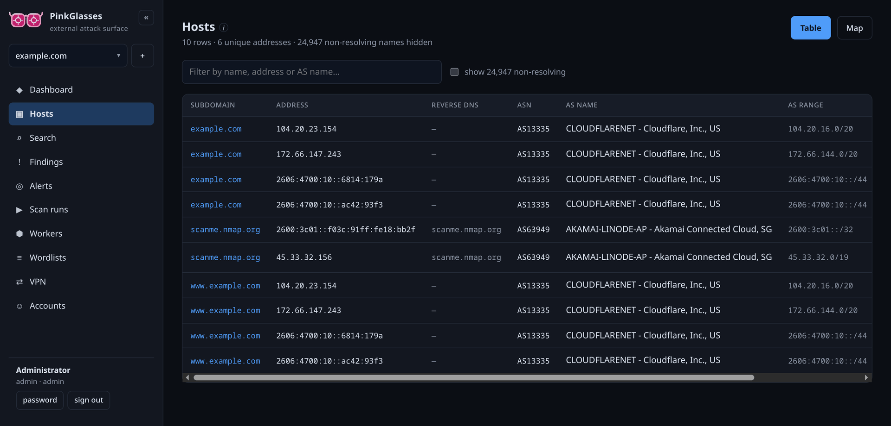
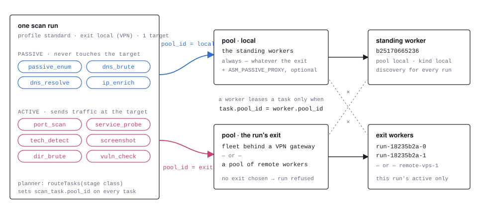
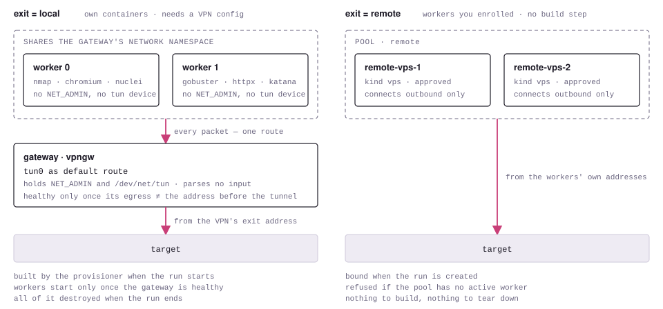
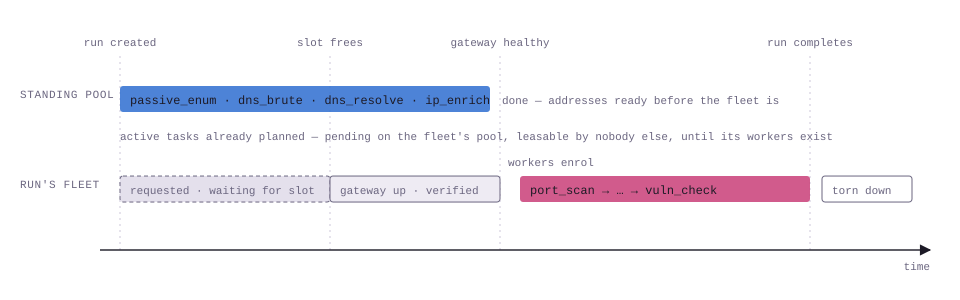

<p align="center">
  <picture>
    <source media="(prefers-color-scheme: dark)" srcset="assets/brand/lockup-dark-1880.png">
    
  </picture>
</p>

A self-hosted web application that discovers and continuously monitors the external attack
surface of one organization — domains, DNS, hosts, open ports, services, technologies, TLS
and findings. DNSDumpster-style discovery output; Shodan-style drill-down. Scanning runs on
a fleet of workers you own, including VPS boxes you enroll from the UI.

<p align="center">
  
</p>
<p align="center">
  <sub>The Hosts view — every name and address found for one company, with reverse DNS,
  ASN and announced prefix. Non-resolving names are folded away by default; here 24,947
  of them.</sub>
</p>

Design docs: [`architecture.md`](architecture.md) · [`worker-pipeline.md`](worker-pipeline.md)
· API reference: [`wiki/API.md`](wiki/API.md) · OpenAPI: [`docs/openapi.yaml`](docs/openapi.yaml)
· build plan: [`TODO.md`](TODO.md)

## Architecture at a glance

```
Browser ── HTTPS ──▶ api ─────┐
                              ├─▶ PostgreSQL (source of truth)
Workers ── WSS/HTTPS ─▶ gateway┘         │
   (your VPS boxes)     scheduler ◀───────┘  advances runs, reaps leases, diffs
```

- **api** — user-facing REST + SSE surface, serves the SPA.
- **gateway** — the only internet-facing service; terminates worker control channels, leases
  tasks, ingests **confined** results, presigns artifact uploads.
- **scheduler** — leader-elected loop: advances the stage machine, reaps expired leases,
  runs the differ, sweeps for stale workers / expiring certs.
- **worker** — one box carrying the whole toolchain; connects outbound only.

## Scan pipeline (per run, across many targets)

```
subdomains ─┬─────────────────┐
            └─ dns bruteforce ┴→ dns resolve ─→ [new addresses, deduped]
                                                  → port scan (batched, 64/task)
                                                         → service probe
                                                              ├─ tech detect
                                                              ├─ screenshot
                                                              ├─ directory brute
                                                              └─ vulnerability check
```

Tools per stage (ProjectDiscovery where it fits; the worker falls back to pure-Go
implementations when a binary is absent, so it works before you install anything):

| Stage | Primary tool | Fallback |
|---|---|---|
| Subdomains | subfinder | stdlib resolver |
| DNS bruteforce | shuffledns + massdns | skipped |
| Resolution & enrichment | dnsx, Team Cymru; a wildcard probe per apex | stdlib resolver |
| Ports & services | **nmap -sV** alone at top-100; naabu → nmap when wider | Go connect-scan |
| Tech & versions | httpx `-tech-detect`, cookie names | header/body fingerprint |
| Screenshots | httpx `-screenshot` | (needs `browser` capability) |
| Directory brute | katana, urlfinder → gobuster/ffuf | built-in common-path probe |
| Vulnerabilities | nuclei, default templates, severity low and up | skipped |

**Every live web endpoint gets a nuclei pass.** Once the service probe has found what
answers HTTP on a host, `vuln_check` runs nuclei against each endpoint with its default
template set, at severity *low* and above by default — *Minimum severity* under
Customize scanning changes that per run, and `nuclei_enabled` turns the stage off. Each
match becomes a finding of kind `nuclei:<template-id>` with the template's severity and
the matched URL, so it shows on the Findings page and the host page with the same dot
history as every other finding. nuclei fetches its templates on a worker's first run;
to pin a revision or ship your own set, point `ASM_NUCLEI_TEMPLATES` at a directory
inside the worker container and it is passed as `-t`. That reaches the standing worker
service; the workers a run builds for itself start from the worker image and fetch the
default templates on first use, which is part of why the first nuclei task of a fleet
takes minutes.

**DNS bruteforce is a separate task per wordlist**, so several lists spread across
workers instead of grinding through one after another. See
[Wordlists and resolvers](#wordlists-and-resolvers).

**Port scanning is batched and incremental.** Resolution feeds addresses forward as
they appear rather than waiting for every name to resolve, and each port-scan task
carries a pool of up to 64 addresses handed to nmap on stdin (`-iL -`). Both halves
matter:

- *Incremental* — a slow wordlist no longer holds back scanning of the hosts already
  found. Addresses are deduplicated as they arrive, so a shared IP behind twenty
  names is still scanned once.
- *Batched* — nmap is built to scan host groups. One address per task makes
  `--min-hostgroup` and `--min-rate` meaningless and pays process startup per host;
  a real pool makes the rate limits mean what they say.

**Only authorized targets are port-scanned.** The planner resolves each address back
to the scope target that produced it and drops the ones whose target is passive-only,
so a name discovered under passive authorization can be enumerated and resolved but
never has a packet sent to it. The scheduler log says so explicitly when it happens.

**Every resolved address carries its network provenance** — reverse DNS, AS
number, AS name and the announcing prefix. dnsx supplies PTR; the ASN details
come from Team Cymru's DNS interface, which needs no extra binary and no API key.
Enrichment runs once per unique address, not once per name.

## Run it (docker-compose)

```bash
cp .env.example .env
docker compose up --build -d      # postgres, minio, migrate, api, gateway, scheduler, worker
# UI:            http://localhost:8080
# gateway:       http://localhost:8090   (the only service you expose in production)
# MinIO console: http://localhost:9001   (minioadmin / minioadmin)
```

The bundled local worker enrols itself, is auto-approved, and appears under
**Workers → Local workers**. Add a scope, add a target, then start a scan from **Runs**.

A good first target is `scanme.nmap.org`, which Nmap's authors publish for exactly this
purpose. Add it as an **active** target (port scanning is refused otherwise) and a
standard run walks the whole pipeline in about a minute, ending with 22/tcp and 80/tcp
open on `45.33.32.156`.

### Signing in

The first boot creates one administrator, **`admin`**, with a password it
generates and prints **once**, in the api log:

```
docker compose logs api | grep "default administrator"
  WARN created the default administrator account — this password is printed ONCE … username=admin password=Xk3…
```

Copy it, sign in, and change it under **password** at the foot of the sidebar —
the UI carries a banner until you do, and the api says so at every start. The
password appears nowhere else and is never printed again.

To choose it yourself instead, set this before first boot:

```bash
ASM_DEFAULT_ADMIN_PASSWORD=$(openssl rand -base64 24)
```

Or set it to `-` to create no account at all, in which case the first visit asks
you to create an administrator.

The account is only ever created on an empty database, so deleting or renaming
it is permanent — as is losing the password. If you lock yourself out,
`go run ./tools/pwhash 'new password'` prints a hash you can write straight into
`app_user.password_hash`.

## Stop it

```bash
docker compose down          # stop everything, KEEP scan data
docker compose down -v       # stop everything and DELETE the database + artifacts
```

`down` removes the containers but keeps the `pgdata` and `miniodata` volumes, so your
scopes, inventory and scan history survive. Add `-v` only when you want a clean slate —
it is irreversible.

Other useful forms:

```bash
docker compose stop                  # pause without removing containers (resume: start)
docker compose start                 # resume after `stop`
docker compose restart api           # restart one service
docker compose down --rmi local      # also delete the images this project built
docker compose ps                    # what is currently running
docker compose logs -f api worker    # follow logs
```

Local worker containers created from the UI are managed by the `provisioner`, not by
compose, so `docker compose down` leaves them running. Scale them to 0 in
**Workers → Add local worker** first, or remove them directly:

```bash
docker rm -f $(docker ps -aq --filter label=asm.managed=true)
```

### Workers: local or external

**Both kinds do the same job — scanning your external targets.** Internal (RFC1918)
ranges are out of scope for this product entirely and are skipped for every worker.
Kind decides only where the traffic comes from and how the worker enrols.

| | Local | External (VPS) |
|---|---|---|
| What it scans | Your external targets | Your external targets |
| Traffic leaves from | Your corporate IP | The provider's IP |
| Setup | Free, already running | A box you rent and enrol |
| Enrolment | Self-enrols, auto-approved | Installer + manual approval |

Local workers alone are a complete scanning system — the stack scans your perimeter as
soon as it is up. Add VPS workers for **egress diversity** (not every packet leaving one
corporate IP) and a **true outside-in view**: your own egress filtering and firewall
policy quietly shape what a local worker sees, so a local worker can report a service as
reachable when in fact only you can reach it.

**Add local workers** — click **Workers → Add local worker**, pick a count, apply. The
`provisioner` service creates the containers; they self-enrol over the internal network
and are auto-approved.

The button is served by an isolated `provisioner` sidecar — the **only** container with
the Docker socket. The socket is root-equivalent on the host, so it is deliberately kept
out of the `api`, which is internet-adjacent and holds your whole attack-surface map. The
provisioner speaks a fixed vocabulary (list / scale labelled worker containers) and cannot
run arbitrary Docker commands.

Prefer not to mount the socket at all? Delete the `provisioner` service from
`docker-compose.yml` — the UI then shows this command instead:

```bash
docker compose up -d --scale worker=3
```

### Managing workers

Each worker row in **Workers** offers these actions. The `i` buttons on the *Status* and
*Actions* column headers show the same summary in the UI.

| Action | Use it when |
|---|---|
| **approve** | A newly enrolled worker should start taking scan tasks. VPS workers need this; local ones are approved automatically. |
| **drain** | Planned wind-down — decommission, reboot or patch a worker. |
| **quarantine** | The worker may be compromised and must be cut off now. |
| **resume** | Return a draining or stale worker to active. |
| **remove** | Delete it from the fleet. A local worker's container is destroyed first. |

**drain vs. quarantine** — they take a worker out of service for opposite reasons, and the
difference matters:

- **drain is planned and graceful.** New leases stop, but tasks already running are allowed
  to finish and report their results. Use it to retire a VPS or reboot a host without
  breaking a scan in flight; **resume** puts it back. Without drain your only option is
  killing the worker mid-task and waiting for its lease to expire before another worker
  retries the work.
- **quarantine is unplanned and defensive.** It blocks new leases *and* refuses the control
  channel outright. Crucially it **keeps the worker record and its history**, which is the
  whole difference from removing it: every observation stores the `worker_id` that produced
  it, so after a quarantine you can find and re-verify exactly what that worker contributed
  instead of distrusting the entire inventory.

Quarantine is also applied **automatically**: if a worker reports observations for assets
outside the target it was assigned, the gateway quarantines it on the spot. Workers parse
hostile content from the internet, so one turning malicious must not be able to poison the
inventory with fabricated assets (`architecture.md` §10.4).

| | drain | quarantine |
|---|---|---|
| Reason | Routine maintenance | Suspected compromise |
| Tasks in flight | Allowed to finish | Should be cut off |
| Trust in its data | Unchanged | Suspect — re-verify what it reported |
| Triggered by | You | You, or automatically on a confinement violation |

### Add your own VPS as a worker

1. In the UI, **Workers → Add VPS worker** → copy the one-line install command.
2. Paste it on the VPS (it needs Docker). The worker connects **outbound only** — no inbound
   ports, works behind NAT.
3. Approve the new worker in **Workers**.

The install token is single-use and expires in 1 hour; the worker's long-lived credential is
minted on enrollment and never leaves the box. See `scripts/install.sh`.

## Accounts and access

A fresh install starts with one account, `admin`, whose password is generated at
first boot and printed once in the api log — see [Signing in](#signing-in). Change
it on first sign-in; the UI nags until you do. Every endpoint
requires a signed-in session or an API token.

### Roles

Three, and each adds to the one below it:

| Role | Can |
|---|---|
| **viewer** | Read everything — inventory, findings, runs, search. Change nothing. |
| **operator** | Also add companies and targets, edit wordlists and alerts, and **start scans**. |
| **admin** | Also manage accounts and API tokens, enrol and scale workers, and add VPN configurations. |

Starting a scan is what separates viewer from operator, because a scan sends
packets at somebody's infrastructure. Adding a VPN configuration or enrolling a
worker is admin, because both hand out credentials.

Manage accounts under **Accounts** in the sidebar (administrators only). You can
change a username there; history stays attached to the account rather than to the
name, so renaming loses nothing (if an identity proxy is in front, change what it
sends to match). Disabling an account is reversible and keeps its history;
removing one is not. Either takes
effect immediately — changing a role, disabling an account or setting a new
password signs that person out everywhere on their next request.

The last enabled administrator cannot be demoted, disabled or deleted. Promote
someone else first; otherwise the only way back in is `psql`.

### API tokens

For scripts and CI, so automating something does not mean sharing a password.
Create one under **Accounts → API tokens**, then:

```bash
curl -H "Authorization: Bearer pgt_…" http://localhost:8080/api/v1/scopes
```

The secret is shown **once**, at creation — only a hash is stored, so it cannot
be retrieved later. Lose it and you revoke it and make another. A token may be
narrower than the person who created it, never wider: an admin can mint a
read-only token for a dashboard, and a viewer cannot mint an admin token.
Revoking one, or disabling its owner, stops it working immediately.

### Passwords

Minimum 12 characters, and that is the only rule — length is worth more than
punctuation, and composition rules mostly produce `Password1!`. They are stored
as argon2id.

Sign-in is rate limited to 10 attempts per 15 minutes, counted per username *and*
per source address. An unknown username takes the same time and gives the same
answer as a wrong password, so the login form does not tell you who has an
account.

### Putting an identity proxy in front

If you already run oauth2-proxy, Authelia or Cloudflare Access, the app can take
its word for who you are — but only if the proxy proves it is the proxy:

```bash
ASM_TRUSTED_PROXY_SECRET=$(openssl rand -base64 32)   # on the api
```

Then have the proxy send `X-Forwarded-User: <username>` **and**
`X-Proxy-Secret: <that value>`. The account still has to exist here, with a role;
the proxy says *who*, PinkGlasses says *what they may do*. Create the account
under Accounts with no password — it will only ever sign in through the proxy.

Leave the variable unset and header authentication is off. `X-Forwarded-User` on
its own is refused and logged, because it is just a request header: before this
existed, anything that could reach the API could set it and be anyone.

## Where scans run from

Every scan has two kinds of work, and they leave your network by different doors.

**Passive stages** — subdomain discovery, DNS, enrichment — talk to third-party
sources with your API keys and never send a packet at the target. They always
run on the standing local workers. Set `ASM_PASSIVE_PROXY` (http or socks5) to
put one hop in front of them; DNS stages speak UDP and cannot use it.

**Active stages** — port scan through vulnerability check — send traffic at the
target, so the launch dialog asks where they should leave from. Two choices:

| Exit | What runs the scan | Leaves from |
|---|---|---|
| **Local workers behind a VPN** | containers created for this run, sharing a gateway container's network namespace | the VPN's address |
| **Remote workers** | a pool of workers you enrolled — a VPS | those workers' addresses |

<picture>
  <source media="(prefers-color-scheme: dark)" srcset="assets/diagrams/scan-fork-dark.svg">
  
</picture>

There is deliberately no "from this host". **Local requires a VPN configuration**;
a company with none cannot start a local active scan, and the dialog says so. A
**passive** scan needs no exit at all.

```
vpn gateway ──── tun0, default route ──── the internet
     ▲
     └── network namespace shared by ──── run worker 0, run worker 1, …
                                          (nmap, chromium, nuclei, gobuster)
```

<picture>
  <source media="(prefers-color-scheme: dark)" srcset="assets/diagrams/scan-exits-dark.svg">
  
</picture>

Three things follow from that shape, and they are the reasons for it:

- **The workers never hold `NET_ADMIN` or `/dev/net/tun`.** The container running
  scanners over hostile output is the one most likely to be exploited; it should
  hold the least. Sharing a namespace gives it the tunnel's routing and none of
  its capability.
- **A worker cannot exist outside the tunnel.** Workers start only after the
  gateway is healthy, and it is healthy only once its public address has actually
  changed. If the tunnel never comes up, the run fails with the gateway's own
  error rather than quietly scanning from your address.
- **No other worker can take the run's active work.** Routing is per task and the
  lease is strict: a run's active tasks are leased only by its own fleet or its
  chosen remote pool, and a fleet worker cannot pick up anyone else's.

<picture>
  <source media="(prefers-color-scheme: dark)" srcset="assets/diagrams/scan-timeline-dark.svg">
  
</picture>

Up to 8 workers per local run; at most 3 runs hold their own containers at once
(`ASM_MAX_RUN_FLEETS`). A run over that limit waits — its discovery runs meanwhile
— and starts when a slot frees. The run view says why it is waiting.

### If a VPN does not come up

The run fails with the gateway's own output:

| Message | Cause |
|---|---|
| `the VPN gateway did not report a working tunnel within 90s` | Endpoint unreachable, or wrong credentials |
| `…stopped before its tunnel came up: …` | openvpn's or wg's own error — read it literally |
| `the VPN configuration could not be decrypted` | `ASM_SECRET_KEY` differs from the one it was stored under |
| `the provisioner is unreachable` | Provisioner settings missing on the **scheduler** |
| `this run's own workers stopped reporting for 2m0s` | The tunnel dropped mid-scan |

A WireGuard config whose `AllowedIPs` carries no default route is rejected at
upload. Config bodies are sealed with AES-256-GCM at rest, never returned by any
endpoint, never logged.

## The Hosts view

Names and the machines they point at are one question in practice, so there is a
single **Hosts** page rather than separate Domains and Hosts pages. Each row is a
discovered name with the address it resolves to and that address's provenance:

| Subdomain | Address | Reverse DNS | ASN | AS name | AS range | Services |
|---|---|---|---|---|---|---|

**Names that no longer resolve are hidden by default.** Passive sources record
every name a domain has ever used — certificate transparency and passive DNS
archives go back years — and for a long-lived domain that is tens of thousands of
names, almost none of them current. They are still recorded, the count of what is
hidden is shown, and a checkbox brings them back. They are evidence of past
infrastructure, not present attack surface.

A Map toggle renders the same data as a force-directed asset graph.

**Clicking a row opens that address's own page** at `/host/<id>`, in a new tab — the
Shodan host page for your own inventory. It carries the enrichment, every name that
resolves there, each open port with what answered on it (banner, product and version,
HTTP title and status, response headers, fingerprinted technologies) and the findings
raised against the host or its services. It is a real URL, so it can be bookmarked and
shared, and it needs no company selected to open.

Services with a screenshot offer a **Screenshot** button — on the host page per service,
and in the Hosts list per row — which opens the captured page image.

**Mine / All companies.** The company picker can narrow the list to the companies
you created. "You" is whatever `X-Forwarded-User` says, or `local` — so this tidies
a shared list, it does not protect anything. Real accounts are Phase 17; until then
anyone who can reach the API can list every company by not asking for the filter.


**Seen.** The last column is when that name was last seen resolving to that
address, with the time; hover it for when the pair was first seen. It is the
pair's timestamps, not the name's or the address's alone — a name that moves
between two addresses shows a different date on each row.

**History, per address.** Open a host and each name resolving to it carries a
row of dots, one per completed run that resolved the name: filled where it
pointed at this address, hollow where it pointed elsewhere. Hover a dot for the
date. Under a name that has pointed at other addresses, `also →` lists them, so
a move is visible from either side. Each open port carries the same strip, one
dot per run that port-scanned the address: filled where the port was open,
hollow where the scan ran and did not find it — which is how a port that closed
and came back shows the gap that *first seen / last seen* alone cannot.

Resolution history starts at migration 00023 and port history at 00016; runs
before those looked but left no per-run record, and are left out rather than
read as "did not find".

## Finding history

Scanning the same host again does not overwrite what the last scan knew. Every run
that *could* have seen a finding — one that executed the stage which produces its
kind against that host — records whether it did, and a finding's presence is
computed from that record rather than set by hand:

- **active** — the latest run that looked for it found it;
- **gone since \<date\>** — a later run looked and did not find it.

The Findings page and each host page show this as a **dot-strip**: one dot per run,
oldest on the left, filled when that run observed the finding and hollow when it
looked and did not. Hovering a dot shows the date and time of that run and the
severity it reported, so a gap or a severity change is readable in place. "Seen
7/8" beside it is the same thing as a number.

Presence is judged only against runs that actually looked. A passive scan never
probes for paths, so a path it did not report has not gone anywhere; without that
rule every passive scan would mark the whole inventory as vanished.

The differ records `finding_gone` and `finding_returned` alongside `new_finding`.
The one worth an alert is `finding_returned` — a new finding is noise until triaged,
but something that was gone and is back is a regression.

## Alerts

**Alerts** is where a company's changes get sent. Add a channel — a Slack incoming
webhook or any URL that accepts JSON — and tick which changes it should hear about:
finding returned, new finding, finding gone, new open port, new subdomain, plus a
minimum severity that applies to findings. When a scan finishes, one digest per
channel goes out listing the changes it asked for, regressions first, capped so a
first scan of a big domain is a count rather than four thousand lines.

Every attempt is recorded under **Recent deliveries** with its outcome. A destination
returning 404 for a month is a row that says so, not a silence you discover when
someone asks why nobody heard about the open RDP port. **Send test** posts a sample
digest so a destination can be checked before anything real changes.

A Slack webhook URL is a bearer token; the API returns it masked and never logs it.

## Wordlists and resolvers

**Wordlists** in the UI manages every list a scan needs: the subdomain wordlists
shuffledns brute-forces, the resolver lists it queries through, and the directory
wordlists gobuster brute-forces web services with. All three are the same kind of
object — a line-oriented file — so they share one registry, under three tabs.

Five lists ship as built-ins and download themselves on first boot:

| List | Kind | Size |
|---|---|---|
| assetnote `best-dns-wordlist` | subdomain | ~9.5M entries |
| assetnote `httparchive_subdomains` | subdomain | ~3.2M entries |
| SecLists `common.txt` | directory | ~4.7k entries |
| SecLists `raft-medium-directories` | directory | ~30k entries |
| trickest public resolvers | resolvers | ~12.7k entries |

Until a download finishes the entry shows as `pending` and scans skip it; a download that
fails shows the reason and is retried on every sweep, so a network blip heals itself
rather than disabling the list permanently.

**Files live in object storage, not in the worker image.** A worker downloads each
list once and caches it on disk by content hash, so the same list is never fetched
twice — and editing a list changes its hash, which is what makes workers pick up
the new version rather than serving the old one from cache.

You can **upload** your own list, mark which lists are **used by default**, and
**edit** entries in place. Editing is capped at 4 MB: resolver lists are kilobytes,
but the assetnote wordlists are hundreds of megabytes and are replaced by upload
instead.

Resolver entries are validated on save — each must be an IP, optionally with a
port — and bad lines are reported with their line numbers. A malformed resolver
otherwise degrades every brute force that uses the list with no visible error.

Every list marked default for the subdomain kind becomes **its own dns_brute task**,
so lists run in parallel across workers.

Directory search works the other way round: it uses **one** list per run, so marking
several `dir` lists default picks the first by name and the dispatch log says which. The
size of that list is the main thing deciding how loud a scan is — it is the only stage
that fires thousands of requests at a single host. A run with no `dir` list falls back to
the small list baked into the worker image.

## Scheduled scans

**Runs → + New scan → When.** The same dialog starts a scan now, once at a time
you pick, or on a repeat — and whatever it runs carries the profile, exit and
customized settings chosen in that dialog. *Now* is a run. *Once* is a single
run started for you at that time (overnight, after a maintenance window). *Repeat*
offers hourly, daily, weekly, every 30 or 90 days, yearly, or a custom number of
hours, with the first run within a minute or at a time you set.

Scheduled scans are listed under the runs table, where they are paused, resumed
and removed. Four behaviours are worth knowing:

- **A schedule starts a run through the same code the button does**, so it is
  refused for exactly the same reasons — VPN configuration removed, pool emptied,
  no targets. The refusal is shown in the schedule's row as *did not start*, with
  the sentence, and a repeating schedule tries again next cadence. A broken
  schedule is visible, not silent.
- **A company with a run still going is skipped, never stacked.** The slot is
  re-checked five minutes later; a slow run is not treated as a broken schedule.
- **The cadence does not drift.** The next time is computed from the planned
  time, not from when the run actually started. Yearly is a plain 365 days.
- **A one-off does its job and stops.** Once it has started its run it disables
  itself and shows *ran*; the row stays as the record of what was asked for.

Runs a schedule started carry a **scheduled** label in the run list. History —
finding, resolution and port dots, the differ, alert digests — is what recurring
scans are for: it only accumulates if scans recur.

## Watching a scan

The **Runs** table gives each run a line: when it started, what it is scanning, how far
along it is, and its status. The target cell names the first few targets and counts the
rest; the progress bar counts failed tasks as finished — the run has dealt with them —
but marks them separately, because a full bar should not hide whether everything worked.
A run's task total climbs while it is running: the planner adds stages as it discovers
work, so 5/9 can become 5/12 without anything being wrong.

**Stop, pause, resume, rerun.** Each row offers what fits its state. *Pause* holds a
running scan: no further task is handed to any worker, the tasks already in flight finish
and report, and the run's own workers and VPN gateway stay up so *Resume* continues at
once. *Stop* ends it; unfinished tasks are cancelled and the run's containers come down.
A finished, failed or stopped run offers *Rerun*: a new run with the same profile,
settings, wordlists and exit, through the same checks as a fresh start — so a rerun whose
VPN configuration has since been removed is refused with that reason rather than started
from somewhere else. A paused run still counts as "going" for a schedule, which skips its
slot rather than stacking a second run.

Expanding a run shows, refreshed every few seconds:

- **Pipeline** — a chip per stage with done/total, a dot while work is in flight,
  and a count of failures
- **Workers on this scan** — each worker, how many tasks it is running and has
  finished, and which stages it is on
- **Activity** — running tasks first, then recently finished: stage, target,
  which worker, status, retries and elapsed time

The same story appears in the worker log:

```
tool finished  tool=subfinder args="-silent -json -d example.com -max-time 3"
               results=24948 took=1.949s ok=true
passive enumeration  domain=example.com candidates=24949
               by_source="map[seed:1 subfinder:24948]"
dns_brute finished   wordlist="best-dns-wordlist" resolvers="trickest" found=37
address enrichment   addresses=4 with_asn=4 with_ptr=0
queued port scans    addresses=2 tasks=1
tool finished  tool=nmap args="-Pn --open --min-hostgroup 64 --min-rate 10000 ...
               --top-ports 100 -sV -oG - -iL -" results=4 took=8.936s ok=true
port scan      hosts=2 with_open_ports=1 open=2 scanner=nmap ports="--top-ports 100"
```

`addresses=2 tasks=1` is the batching: both addresses went to nmap as one host group.
A tool that exits cleanly but produces nothing while writing to stderr is reported as a
failure too — naabu rejecting a flag and exiting 0 looked exactly like "found nothing"
until that check existed.

`by_source` is worth watching: it distinguishes a dead API key or a rate-limited
provider from a domain that genuinely has few names.

Set `ASM_LOG_LEVEL` to `debug` for the individual findings behind those summaries —
every candidate name, port with its product, discovered path, and each tool's
command line before it runs:

```bash
ASM_LOG_LEVEL=debug docker compose up -d worker
```

`info` (the default) is every tool invocation and stage summary; `warn` and `error`
narrow it further.

## Develop

Backend (Go 1.23):

```bash
make build            # builds api, gateway, scheduler, worker, migrate into ./bin
make migrate          # apply DB migrations (needs ASM_DATABASE_URL)
./bin/api             # :8080
./bin/gateway         # :8090
./bin/scheduler
go test ./... && go vet ./...
```

Frontend (Node 20):

```bash
cd web
npm install
npm run dev           # :5173, proxies /api to :8080
npm run build         # emits web/dist, served by the api binary
```

## Passive discovery API keys

Passive enumeration finds subdomains without sending a single packet at the
target, and it gets substantially better with API keys. `.env.example` lists
**every source subfinder accepts a credential for** — 40 of them, grouped by what
they are. Copy it to `.env` and paste in whichever you have; every one is
optional and blanks are skipped.

```
# Certificate transparency and DNS history
CERTSPOTTER_API_KEY=   DNSDB_API_KEY=       DNSDUMPSTER_API_KEY=  DNSREPO_API_KEY=
MERKLEMAP_API_KEY=     SECURITYTRAILS_API_KEY=  WHOISXMLAPI_API_KEY=

# Internet-wide scan indexes
CENSYS_API_ID= / _SECRET=   FOFA_EMAIL= / FOFA_API_KEY=   FULLHUNT_API_KEY=
NETLAS_API_KEY=   ONYPHE_API_KEY=   QUAKE_API_KEY=   SHODAN_API_KEY=   ZOOMEYE_API_KEY=

# Threat intelligence and reputation
ALIENVAULT_API_KEY=  LEAKIX_API_KEY=  THREATBOOK_API_KEY=  URLSCAN_API_KEY=
VIRUSTOTAL_API_KEY=

# Recon platforms and aggregators
BEVIGIL_API_KEY=  BUFFEROVER_API_KEY=  BUILTWITH_API_KEY=  C99_API_KEY=
CHAOS_API_KEY=  CHINAZ_API_KEY=  DIGITALYAMA_API_KEY=  DOMAINSPROJECT_API_KEY=
DRIFTNET_API_KEY=  HACKERTARGET_API_KEY=  INTELX_HOST= / INTELX_API_KEY=
PROFUNDIS_API_KEY=  PUGRECON_API_KEY=  RECONEER_API_KEY=  REDHUNTLABS_API_KEY=
ROBTEX_API_KEY=  RSECLOUD_API_KEY=  SUBMD_API_KEY=  WINDVANE_API_KEY=

# Code search
GITHUB_TOKEN=
```

Twelve more sources need no key at all and are always used: `anubis`,
`commoncrawl`, `crtsh`, `digitorus`, `hudsonrock`, `rapiddns`, `scanmalware`,
`shodanct`, `sitedossier`, `thc`, `threatcrowd`, `waybackarchive`.

**Paste the value and nothing else.** A `.env` file has no inline comments, so
`SHODAN_API_KEY=abc123  # my key` sets the key to `abc123  # my key` and the
provider rejects it.

Three sources take two parts, which the worker joins the way subfinder expects —
Censys as `ID:SECRET`, FOFA as `EMAIL:KEY`, IntelX as `HOST:KEY`. Set both halves
or neither; half a credential is skipped and said so in the log.

Compose passes them to the worker, which renders subfinder's
`provider-config.yaml` at startup and logs which sources came up configured:

```
passive sources configured  count=3  sources="[censys github shodan]"
```

Keys live only in `.env` (git-ignored) and in the worker's environment. They are
never stored in the database, never shown in the UI, and never written to a log —
the config file is mode 0600 and only source *names* are logged.

These calls go to the providers, never to the target, so their exit is not a scan
concern — but it is still this host's address at forty APIs. `ASM_PASSIVE_PROXY`
(http or socks5) puts one hop in front of subfinder; DNS stages cannot use it.

If you upgrade subfinder and it renames or drops a source, the worker says so at
startup instead of ignoring your key. That check exists because it had already
happened: `zoomeye` had become `zoomeyeapi`, and `hunter` and `binaryedge` were
gone, so three keys were being written into a config subfinder read straight
past.

## Safety & authorization

This tool sends packets to real infrastructure. Read `architecture.md` §10 first.

- A target is **passive-only** unless it carries an explicit **active** authorization record.
- CDN / shared-hosting IPs are excluded from port scanning by default.
- RFC1918 / loopback targets are always rejected — this tool scans the external
  perimeter only, which is also what closes the scanner-as-SSRF hole. The check runs
  twice: once on the target itself, and once on every address discovery resolves, since
  a name under an authorized target can still point at 127.0.0.1 or a cloud metadata
  address. `ASM_ALLOW_PRIVATE_TARGETS=true` lifts it for a local test target such as
  `tools/cookielab`, and must not be set on anything reachable by anyone else.
- **Cookie names are recorded; cookie values are not.** A name like `webvpn` or
  `BIGipServer...` identifies the appliance behind a port and is searchable with
  `cookie:webvpn*`; the value is a session token, so `Set-Cookie` is dropped from the
  stored headers rather than kept.
- Enrolled workers are **semi-trusted**: they only ever see their current job's targets, and
  the gateway rejects (and quarantines a worker for) any observation outside that set.
- Your VPS provider may suspend accounts over unsolicited scanning — set per-worker rate caps
  and keep an abuse-contact note. Never expose the UI to the internet; put an
  identity-aware proxy in front.

## Layout

```
cmd/         api · gateway · scheduler · worker · provisioner · migrate
internal/    domain · store · scanproto · scopeguard · planner · dispatch · ingest · diff
             search · notify · obj · audit · httpapi · agentapi · provisioner
             scanparams (the settable scan knobs) · wordlists (registry seeding)
             scanner (the pipeline)
migrations/  goose SQL
web/         Vite + React + TS SPA
deploy/      worker Dockerfile
```

## Status

Working end to end, verified against `scanme.nmap.org`: passive enumeration and DNS
brute-forcing, resolution with ASN and reverse-DNS enrichment, batched port and service
scanning, technology detection, screenshots, directory brute-forcing and the nuclei
vulnerability check — every stage confirmed by what it stored, not just by the tool
running. A scan of that host records
`OpenSSH 6.6.1p1` on 22, `Apache 2.4.7` with `Apache HTTP Server 2.4.7` and `Ubuntu` on
80, a page screenshot, and the paths its crawl and brute force found.

Supporting that: a wordlist registry for all three list kinds that workers fetch and
cache, per-worker scan visibility that survives a worker being replaced, and a per-address
page for drilling into any of it. The Go control plane and worker build and vet clean, the
test suite passes, and the SPA type-checks and builds.

The worker prefers real tools when installed and falls back to Go implementations
otherwise, so a tool can be swapped or removed behind the `scanner` package without
touching the rest of the system.

**The recurring failure mode in this project is a stage doing its work and the results
evaporating downstream**, which looks exactly like a clean "found nothing". Three checks
exist to make that visible, and each was added after it had already happened: every tool
invocation is logged with its result count and duration; a tool that exits 0 while
producing nothing and writing to stderr is reported as a failure; and a batch of results
the gateway refuses is logged by both the worker that sent it and the gateway that
rejected it, with the reason.

Deliberately deferred (see `architecture.md` §14): multi-tenancy, ClickHouse analytics,
SSH-push provisioning, worker auto-update, cloud-inventory connectors.

Known rough edges:

- Provisioner-created workers are not rebuilt by `docker compose up --build`, so they keep
  running an older image until removed and recreated.
- Wordlist downloads use the resolver a container was started with. If that resolver
  disappears — a VPN dropping is the usual cause — fetches fail until the service is
  recreated (`docker compose up -d --force-recreate scheduler`), at which point they
  retry themselves.
- Configuration keeps the `ASM_` environment-variable prefix and the `asm` database role
  from before the project was renamed, so existing `.env` files and volumes keep working.
  The compose volumes are pinned to their original `scan_tool_*` names for the same
  reason — renaming them would orphan the database.


Do you need to set the number of local containers? No, not for a normal setup. Two different things share the word "workers":

- The standing local workers (Workers → Add local worker, or --scale worker=N) now only run the passive stages: subfinder, DNS brute force, resolution, enrichment. They never touch a target. The default single container runs 8 tasks at once, which is plenty for one or a few companies. Adding more only helps when many companies scan simultaneously or you run very large brute-force wordlists, since each wordlist is its own task and spreads across workers.

- The workers that do the active scanning are created per run. When you start a scan from local workers behind a VPN, the dialog's Workers field (1 to 8, default 2) is the count that matters, and those containers are destroyed when the run ends. Remote scanning uses whatever you enrolled in that pool.

So the "Add local worker" control is optional capacity for passive discovery, not something a fresh install has to configure. The README's Workers section still presents scaling as a primary setup step, from before per-run fleets existed. I can rewrite that section to say the above if you want.