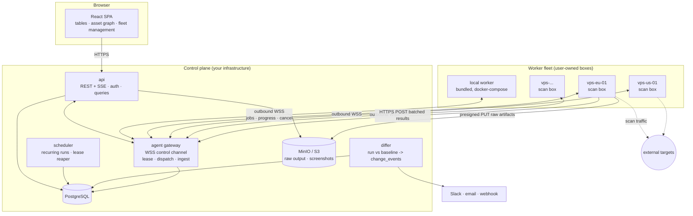
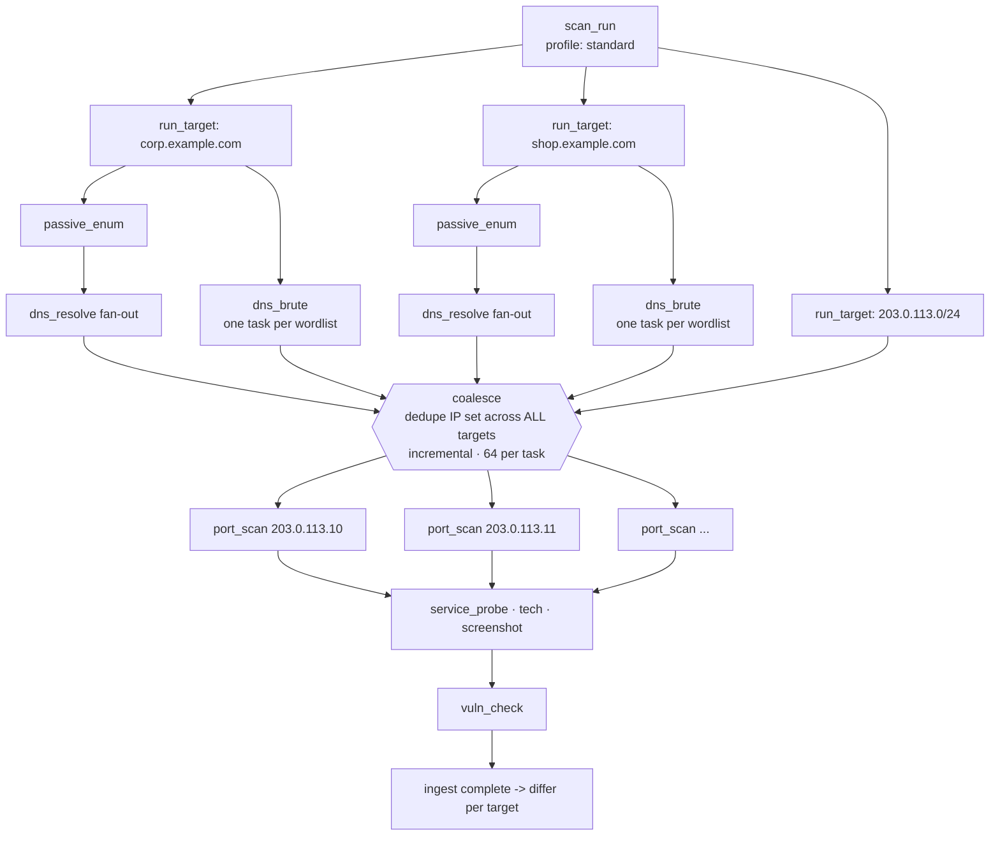
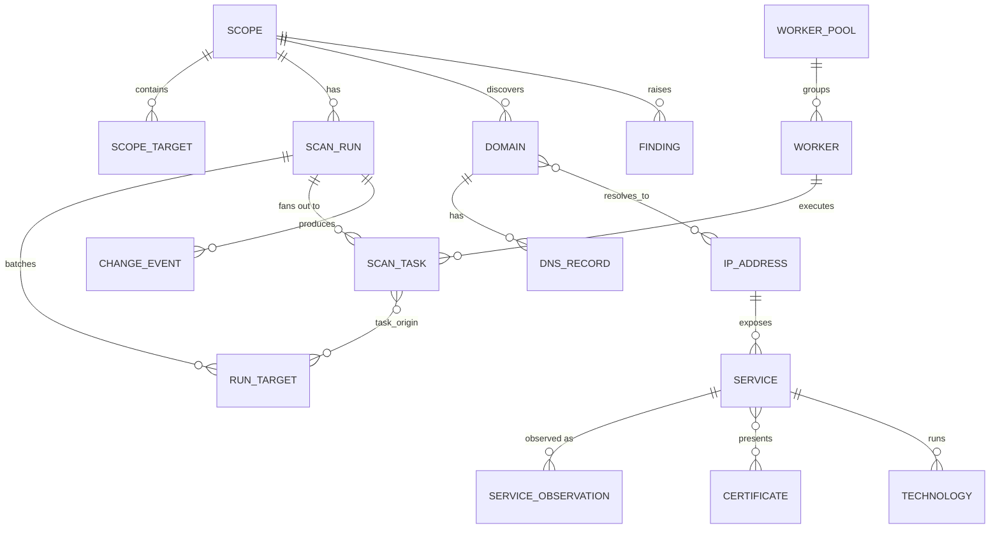
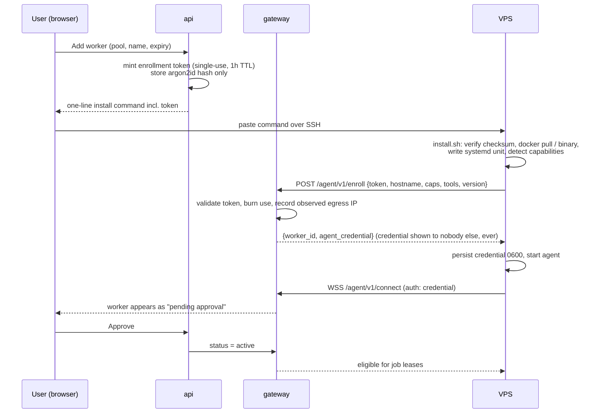
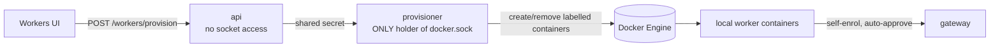

# PinkGlasses — Architecture Plan

> A self-hosted web application for discovering and continuously monitoring the external
> attack surface of one organization: domains, DNS, hosts, open ports, services, TLS,
> technologies and findings. DNSDumpster-style discovery output, Shodan-style drill-down.

**Status:** design proposal, v0.2
**Stack decision:** Go (API + workers), PostgreSQL, React/TypeScript
**Scale target:** single organization, self-hosted. Hundreds of root domains, tens of
thousands of hosts, thousands of services. Not internet-wide scanning.

**v0.2 changes:** scan runs take **many targets at once**; the worker is a **single
self-contained scan box** carrying the whole toolchain rather than one worker per stage;
users **enroll their own VPS servers as workers** from the web UI, and those workers are
treated as semi-trusted machines outside the control plane's network.

---

## 1. Product shape (what the architecture must support)

Three levels of zoom, and the data model exists to serve them:

| Level | View | Example content |
|---|---|---|
| **Scope** | Attack-surface dashboard | 12 domains, 340 subdomains, 89 hosts, 412 services, 7 new since last scan, 3 expiring certs |
| **Domain** | DNSDumpster-style page | DNS records table (A/AAAA/MX/NS/TXT/CNAME/SOA/CAA/SRV), subdomain list, host map graph, exportable |
| **Host / IP** | Shodan-style page | ASN, geo, PTR, cloud provider, open ports, per-service banners, TLS chain, tech stack, other domains resolving here, history |
| **Service** | Port detail | Raw banner, HTTP response headers, screenshot, detected products + versions, related findings |

Plus three cross-cutting capabilities that shape the whole design:

1. **Batch runs.** The unit of work is a run over **a set of targets** — select several
   domains, a tag, or the entire scope, and launch one scan. Everything downstream
   (progress, diffing, reporting) is per-run *and* per-target. See §4.
2. **Temporal state.** Every asset carries `first_seen` / `last_seen`. "What is live now"
   and "what changed since last week" are the same tables.
3. **Change events & alerts.** A new subdomain, a newly opened port, a dangling CNAME, a
   cert expiring in 14 days. This is the actual security value of the product.

And one operational capability that is a product feature in its own right:

4. **A worker fleet the user owns.** Scans run either on the bundled local worker (works
   out of the box) or on VPS boxes the user enrolls from the UI with a one-line installer.
   Different workers mean different egress IPs, different geographies, and scan capacity
   that scales without touching the control plane. See §6–§8.

---

## 2. High-level architecture



### The three decisions that define this architecture

**1. The worker is one box, not one-worker-per-stage.**
A single binary/image carrying the entire toolchain — subfinder, DNS resolver pool, naabu,
httpx, TLS prober, wappalyzergo, nuclei, headless Chrome. It can execute any stage of the
workflow. Rationale: a user adding a VPS wants to add *scan capacity*, not to reason about
which of five worker types they are short of. Stage specialization survives only as an
optional capability flag (§6.2) for boxes that genuinely cannot do something — no raw
sockets on a locked-down VPS, no browser on a 512 MB node.

**2. Workers connect outbound only and never touch the database.**
A VPS in Hetzner cannot reach your Postgres, and you should not want it to. Workers open an
outbound WebSocket to the agent gateway, receive job assignments on it, and push results
back over HTTPS. No inbound ports, no firewall changes, works behind NAT. This also means a
worker is disposable: destroy the VPS, the fleet reconverges.

**3. Two queues, split by trust boundary.**
Internal orchestration jobs (fan-out, enrichment, diffing, notifications) run on
[River](https://riverqueue.com) — Go, Postgres-backed, transactional enqueue, no extra
infrastructure. Scan tasks destined for remote workers use a **lease table** claimed through
the gateway (§8.1), because a remote agent cannot hold a database transaction open and must
be assumed to die mid-task without saying goodbye.

Everything else stays a **modular monolith**: one Go module, several `cmd/` binaries sharing
`internal/`. At single-org scale, splitting the API into services buys nothing.

---

## 3. Component breakdown

### 3.1 `api` (Go)

- **Router:** `chi`. **DB:** `sqlc` + `pgx/v5` — hand-written SQL compiled to typed Go.
  Avoid an ORM; these queries are graph-ish, temporal and index-sensitive, and you want to
  read them. **Migrations:** `goose`, plain SQL, forward-only.
- Serves the UI's read API, scope/target CRUD, run triggering, search, findings workflow,
  exports, and fleet management endpoints.

### 3.2 `gateway` (Go) — the agent-facing service

Deployed as a separate binary (and separate hostname/ingress) from the user-facing API,
because it faces semi-trusted machines on the public internet:

- Terminates worker WebSocket control channels; tracks liveness and load per worker.
- Leases scan tasks to workers matching capability + pool constraints (§8.1).
- Accepts batched result ingest; validates that every observation is inside the job's
  assigned target set (§10.3).
- Issues presigned object-storage URLs so raw tool output and screenshots go straight to
  MinIO/S3 without transiting the gateway.
- Handles enrollment: token redemption, worker registration, credential issuance.

### 3.3 `scheduler` (Go)

Leader-elected via a Postgres advisory lock — no etcd.
- Recurring runs per scope/target-set (passive daily, standard weekly, deep monthly).
- **Lease reaper:** requeues scan tasks whose lease expired (worker died or lost network).
- Non-scanning sweeps: cert expiry, finding SLA aging, cloud IP-range feed refresh.
- Fleet health: marks workers stale after N missed heartbeats, drains their tasks.

### 3.4 `differ`

Compares a completed run against the previous baseline **per target**, emitting
`change_event` rows. Kept separate from ingest so a partial run never produces false
"asset disappeared" alerts — a target only becomes a diff baseline once its own task graph
finished with an acceptable success ratio. In a 40-domain batch run, 39 targets can diff
normally while one that failed is skipped.

### 3.5 `worker` (Go) — the scan box

See §6. Same repo, same module, separate binary and image.

### 3.6 Frontend (React + TypeScript)

- Vite, TanStack Router + Query, Tailwind + shadcn/ui, TanStack Table for the dense tables
  (the graph is the demo; the table is the tool).
- **Graph view:** Cytoscape.js with `fcose` layout for the DNSDumpster-style map. Handles
  thousands of nodes, supports collapse/cluster, exports PNG/SVG. Switch to `sigma.js`
  (WebGL) only if graphs exceed ~10k nodes.
- **Live progress:** SSE from the API (`/runs/{id}/events`). Traffic is one-directional;
  SSE reconnects for free and survives proxies without upgrade negotiation.
- **Workers page:** worker list with status, egress IP, geo, version, current load, last
  heartbeat; "Add worker" wizard; approve/quarantine/drain/remove actions.
- **Host page:** each address has its own route (`/host/<id>`) rather than a dialog, so it
  can be opened in a tab, bookmarked and shared. It takes no scope: an address identifies
  its own scope, which is what lets a link work from a cold start. It carries the
  enrichment, the names resolving there, every open port with its latest observation and
  fingerprinted technologies, its screenshot, and the findings against the host or its
  services.
- **Screenshots are relayed by the API**, never linked from object storage. The app's CSP
  allows images from `self` only, so a presigned URL would be blocked with no visible
  error, and it would embed a bearer token for that object in the page. They are addressed
  by service id, so the object key never leaves the server.

### 3.7 Package layout

```
cmd/
  api/            # user-facing HTTP
  gateway/        # agent-facing WSS + ingest
  worker/         # the scan box
  scheduler/
  migrate/
internal/
  domain/         # entities + rules, no I/O
  store/          # sqlc-generated + repositories
  httpapi/        # UI handlers, DTOs, OpenAPI
  agentapi/       # gateway protocol handlers
  planner/        # run -> task DAG fan-out, coalescing, fairness (§4)
  dispatch/       # lease, capability matching, reaper
  fleet/          # enrollment, credentials, health, pools
  ingest/         # normalize observations -> temporal upsert
  diff/           # run comparison -> change_events
  scanproto/      # SHARED wire contract: job + result types  <-- the only shared package
  scanner/        # stage implementations (worker-side)
  scopeguard/     # authorization + exclusions (§10)
  search/         # query language -> SQL
  notify/         obj/   audit/
migrations/
web/
```

`internal/scanproto` is the contract between control plane and fleet. Keep it
dependency-free and versioned — remote workers will lag behind the server's version.

---

## 4. Multi-target scan runs

A run takes a **target set**: several domains, a saved tag, a CIDR list, or an entire scope.



### 4.1 Why coalescing is the whole point of batch runs

Two domains in the same batch usually share infrastructure. Naively fanning out per target
would port-scan the same IP two, five, twenty times — wasted traffic, and enough repeated
SYN floods from one source to get your VPS null-routed.

So the planner **coalesces** after DNS resolution: resolved addresses from every target in
the run are deduped against what the run has already queued, filtered through the scope
guard, grouped into scan-friendly blocks of 64, and only then fanned out. This happens
continuously as addresses arrive rather than once behind a barrier (§4.3). Each resulting
task records which targets it originated from:

```sql
CREATE TABLE task_origin (
  task_id       uuid REFERENCES scan_task(id) ON DELETE CASCADE,
  run_target_id uuid REFERENCES run_target(id) ON DELETE CASCADE,
  PRIMARY KEY (task_id, run_target_id)
);
```

That join table is what lets one port-scan result be attributed back to every domain that
pointed at it, so per-domain reporting stays correct after deduplication.

### 4.2 Fairness and progress

- **Per-target progress** is tracked independently (`run_target.status`, task counters), so
  the UI shows a row per domain with its own progress bar. One slow domain with 4,000
  subdomains does not make the other 39 look stuck.
- **Fair dispatch:** the lease query round-robins across `run_target_id` rather than taking
  tasks in insertion order, so a huge target cannot starve the rest of the batch.
- **Per-run and per-scope concurrency budgets** cap how many tasks a run may hold across the
  fleet, so a 50-domain batch cannot monopolize every worker.
- **Partial failure is normal and expected.** A run completes with per-target statuses; the
  differ processes the targets that succeeded and flags the rest as `incomplete`.

### 4.3 Stage barriers — and why there are none left

Discovery fans out per (domain × wordlist), so several wordlists run as independent tasks
the dispatcher spreads across workers rather than serialising millions of names on one box.

`dns_resolve → coalesce → port_scan` used to be a hard barrier: nothing was scanned until
every name in the run had resolved. That is the wrong trade. The barrier existed to
deduplicate addresses — twenty names behind one address must be scanned once — but
deduplication does not need a barrier, only memory of what has already been queued.

Resolution now feeds port scanning **incrementally**. New addresses are queued as they
appear, skipping any already scanned in this run, and grouped into batches of 64 so the
scanners still see a real host pool. A run's task total therefore climbs while it is
running, which the UI shows rather than hides. One slow wordlist no longer holds back
scanning of the hosts already found, and the deduplication the barrier was there for is
unchanged.

Two constraints ride along with that queueing step, both cheap to enforce where addresses
are already being filtered: an address belonging to a passive-only target is dropped
rather than scanned, and CDN or shared-hosting addresses are excluded by default.

Barriers are latency. There are now none in the pipeline.

---

## 5. Data model

The core idea: **an asset graph with temporal edges.** Every entity and relationship carries
`first_seen`, `last_seen`, and the run that observed it. Current state is `last_seen >=
(latest completed run)`. History and diffing come for free.



### 5.1 Scope and authorization

*(Presented in reading order, not migration order — `worker_pool` in §5.3 must be created
before the tables that reference it.)*

```sql
CREATE TABLE scope (
  id uuid PRIMARY KEY, name text NOT NULL, created_at timestamptz NOT NULL DEFAULT now()
);

CREATE TABLE scope_target (
  id            uuid PRIMARY KEY,
  scope_id      uuid NOT NULL REFERENCES scope(id) ON DELETE CASCADE,
  kind          text NOT NULL,            -- 'domain' | 'cidr' | 'asn' | 'ip'
  value         text NOT NULL,
  tags          text[] NOT NULL DEFAULT '{}',   -- select a batch by tag
  mode          text NOT NULL,            -- 'active' | 'passive_only' | 'exclude'
  pool_id       uuid REFERENCES worker_pool(id),  -- optional: scan this only from pool X
  authorized_by text,
  authorized_at timestamptz,
  UNIQUE (scope_id, kind, value)
);
```

### 5.2 Runs, targets, tasks

```sql
CREATE TABLE scan_run (
  id          uuid PRIMARY KEY,
  scope_id    uuid NOT NULL REFERENCES scope(id),
  profile     text NOT NULL,              -- 'passive' | 'standard' | 'deep'
  trigger     text NOT NULL,              -- 'schedule' | 'manual' | 'api'
  status      text NOT NULL,              -- queued|planning|running|completed|failed|cancelled
  pool_id     uuid REFERENCES worker_pool(id),
  max_concurrency int NOT NULL DEFAULT 32,
  started_at timestamptz, finished_at timestamptz,
  stats       jsonb NOT NULL DEFAULT '{}'
);

CREATE TABLE run_target (                 -- one row per domain/CIDR in the batch
  id           uuid PRIMARY KEY,
  run_id       uuid NOT NULL REFERENCES scan_run(id) ON DELETE CASCADE,
  kind         text NOT NULL,
  value        text NOT NULL,
  status       text NOT NULL,             -- pending|running|completed|incomplete|failed|skipped
  skip_reason  text,                      -- 'not_authorized' | 'excluded' | ...
  tasks_total  int NOT NULL DEFAULT 0,
  tasks_done   int NOT NULL DEFAULT 0,
  started_at timestamptz, finished_at timestamptz,
  UNIQUE (run_id, kind, value)
);

CREATE TABLE scan_task (
  id            uuid PRIMARY KEY,
  run_id        uuid NOT NULL REFERENCES scan_run(id) ON DELETE CASCADE,
  stage         text NOT NULL,
  target        jsonb NOT NULL,
  requires      text[] NOT NULL DEFAULT '{}',  -- capabilities: raw_socket, browser, ...
  priority      int  NOT NULL DEFAULT 100,
  status        text NOT NULL,            -- pending|leased|running|done|failed|cancelled
  -- lease fields (§8.1)
  worker_id     uuid REFERENCES worker(id),
  lease_token   uuid,
  lease_expires_at timestamptz,
  attempts      int NOT NULL DEFAULT 0,
  max_attempts  int NOT NULL DEFAULT 3,
  error         text,
  started_at timestamptz, finished_at timestamptz
);
CREATE INDEX ON scan_task (status, priority, run_id) WHERE status = 'pending';
CREATE INDEX ON scan_task (lease_expires_at) WHERE status = 'leased';

CREATE TABLE task_origin (
  task_id       uuid REFERENCES scan_task(id) ON DELETE CASCADE,
  run_target_id uuid REFERENCES run_target(id) ON DELETE CASCADE,
  PRIMARY KEY (task_id, run_target_id)
);
```

### 5.3 Fleet

```sql
CREATE TABLE worker_pool (
  id uuid PRIMARY KEY, name text NOT NULL UNIQUE,
  description text, is_default boolean NOT NULL DEFAULT false
);

CREATE TABLE worker (
  id             uuid PRIMARY KEY,
  pool_id        uuid REFERENCES worker_pool(id),
  name           text NOT NULL,
  kind           text NOT NULL,            -- 'local' | 'vps'
  status         text NOT NULL,            -- pending|active|draining|quarantined|stale|revoked
  capabilities   text[] NOT NULL DEFAULT '{}',   -- raw_socket, browser, ipv6, udp
  tools          jsonb NOT NULL DEFAULT '{}',    -- tool -> version, shown in UI
  agent_version  text,
  egress_ip      inet,                     -- as observed by the gateway, not self-reported
  egress_ip_v6   inet,
  country        text,
  max_concurrency int NOT NULL DEFAULT 8,
  running_tasks  int NOT NULL DEFAULT 0,
  cred_hash      bytea NOT NULL,           -- argon2id of the long-lived agent credential
  cred_rotated_at timestamptz,
  last_seen_at   timestamptz,
  enrolled_at    timestamptz NOT NULL,
  enrolled_by    uuid,
  notes          text
);

CREATE TABLE enrollment_token (
  id          uuid PRIMARY KEY,
  token_hash  bytea NOT NULL UNIQUE,       -- never store the token itself
  pool_id     uuid REFERENCES worker_pool(id),
  created_by  uuid NOT NULL,
  expires_at  timestamptz NOT NULL,        -- short: 1h default
  max_uses    int NOT NULL DEFAULT 1,
  uses        int NOT NULL DEFAULT 0,
  revoked_at  timestamptz
);
```

### 5.4 Assets

```sql
CREATE TABLE domain (
  id uuid PRIMARY KEY,
  scope_id  uuid NOT NULL REFERENCES scope(id) ON DELETE CASCADE,
  name      text NOT NULL,                 -- fqdn, lowercase, punycode-normalized
  apex      text NOT NULL,                 -- eTLD+1 via publicsuffix
  is_wildcard boolean NOT NULL DEFAULT false,
  sources   text[] NOT NULL DEFAULT '{}',  -- ct, bruteforce, ptr, api, scrape
  first_seen timestamptz NOT NULL, last_seen timestamptz NOT NULL,
  UNIQUE (scope_id, name)
);

CREATE TABLE dns_record (
  id uuid PRIMARY KEY,
  domain_id uuid NOT NULL REFERENCES domain(id) ON DELETE CASCADE,
  rtype text NOT NULL,                     -- A|AAAA|CNAME|MX|NS|TXT|SOA|CAA|SRV
  value text NOT NULL, ttl int,
  first_seen timestamptz NOT NULL, last_seen timestamptz NOT NULL,
  UNIQUE (domain_id, rtype, value)
);

CREATE TABLE ip_address (
  id uuid PRIMARY KEY,
  scope_id uuid NOT NULL REFERENCES scope(id) ON DELETE CASCADE,
  addr inet NOT NULL, ptr text,
  asn int, as_org text, country text,
  cloud text,                              -- aws|azure|gcp|cloudflare|null
  is_shared boolean NOT NULL DEFAULT false,-- CDN/shared hosting: do not port scan
  first_seen timestamptz NOT NULL, last_seen timestamptz NOT NULL,
  UNIQUE (scope_id, addr)
);

CREATE TABLE domain_ip (                   -- temporal edge; the DNSDumpster map is this table
  domain_id uuid REFERENCES domain(id) ON DELETE CASCADE,
  ip_id     uuid REFERENCES ip_address(id) ON DELETE CASCADE,
  via text NOT NULL,                       -- 'A' | 'AAAA' | 'CNAME-chain'
  first_seen timestamptz NOT NULL, last_seen timestamptz NOT NULL,
  PRIMARY KEY (domain_id, ip_id, via)
);

CREATE TABLE service (
  id uuid PRIMARY KEY,
  ip_id uuid NOT NULL REFERENCES ip_address(id) ON DELETE CASCADE,
  port int NOT NULL, proto text NOT NULL,
  last_state text NOT NULL,                -- open|closed|filtered
  first_seen timestamptz NOT NULL, last_seen timestamptz NOT NULL,
  UNIQUE (ip_id, port, proto)
);

CREATE TABLE service_observation (         -- per-run trail: "what did it look like on date X"
  id uuid PRIMARY KEY,
  service_id uuid NOT NULL REFERENCES service(id) ON DELETE CASCADE,
  run_id     uuid NOT NULL REFERENCES scan_run(id) ON DELETE CASCADE,
  worker_id  uuid REFERENCES worker(id),   -- which box saw this, from which egress IP
  observed_at timestamptz NOT NULL,
  banner text, product text, version text,
  http jsonb,                              -- status, title, headers, favicon hash, redirects
  tls  jsonb,                              -- version, ciphers, chain summary
  screenshot_key text, raw_key text,
  UNIQUE (service_id, run_id)
);

CREATE TABLE certificate (
  id uuid PRIMARY KEY, sha256 bytea NOT NULL UNIQUE,
  subject_cn text, issuer text, sans text[] NOT NULL DEFAULT '{}',
  not_before timestamptz, not_after timestamptz, self_signed boolean
);

CREATE TABLE technology (
  service_id uuid REFERENCES service(id) ON DELETE CASCADE,
  name text NOT NULL,
  version text NOT NULL DEFAULT '',        -- '' rather than NULL so it can key the PK
  cpe text, confidence int,
  first_seen timestamptz NOT NULL, last_seen timestamptz NOT NULL,
  PRIMARY KEY (service_id, name, version)
);

CREATE TABLE finding (
  id uuid PRIMARY KEY,
  scope_id uuid NOT NULL REFERENCES scope(id) ON DELETE CASCADE,
  asset_kind text NOT NULL, asset_id uuid NOT NULL,
  kind text NOT NULL,                      -- subdomain_takeover|expiring_cert|exposed_admin|nuclei:<id>
  severity text NOT NULL,                  -- info|low|medium|high|critical
  title text NOT NULL, evidence jsonb NOT NULL DEFAULT '{}',
  status text NOT NULL DEFAULT 'open',     -- open|acknowledged|resolved|accepted_risk
  first_seen timestamptz NOT NULL, last_seen timestamptz NOT NULL, resolved_at timestamptz
);

CREATE TABLE change_event (
  id uuid PRIMARY KEY,
  run_id uuid NOT NULL REFERENCES scan_run(id) ON DELETE CASCADE,
  run_target_id uuid REFERENCES run_target(id) ON DELETE SET NULL,
  scope_id uuid NOT NULL REFERENCES scope(id) ON DELETE CASCADE,
  kind text NOT NULL,                      -- new_subdomain|removed_subdomain|new_port|closed_port|
                                           -- ip_changed|new_tech|cert_changed|new_finding
  asset_kind text NOT NULL, asset_id uuid NOT NULL,
  before jsonb, after jsonb,
  created_at timestamptz NOT NULL DEFAULT now()
);
```

**Indexes that matter:** `gist (addr inet_ops)` on `ip_address` for CIDR containment;
`domain(scope_id, last_seen)`; `service(ip_id, port)`; GIN on `service_observation.http`
and `.tls` for the search language; `gin (name gin_trgm_ops)` on `domain` for substring
search across subdomains.

### 5.5 Why temporal upsert rather than event sourcing

An append-only observations table is purer, but every UI query then needs a window function
over the latest run, and it becomes the biggest table in the database within months.

The hybrid: **current-state tables carry `first_seen`/`last_seen`** (cheap, indexable, what
95% of queries want), while **`service_observation` keeps the full per-run trail** for the
one entity where change-over-time is genuinely interesting, and raw tool output lives in
object storage keyed by run. Old observation rows can be rolled up after N months without
losing the asset inventory.

---

### 5.6 Wordlists and resolvers

Subdomain wordlists, DNS resolver lists and directory wordlists are the same kind of
object — a line-oriented file that workers need a copy of — so they share one registry
table keyed by `kind` rather than getting parallel machinery.

The kinds differ only in how a run consumes them. Every default `dns` list becomes its own
`dns_brute` task, so lists brute-force in parallel across workers. A run takes one
`resolvers` list and one `dir` list, because resolution and directory search each use a
single file; when several are marked default the first by name wins and dispatch logs the
choice. In all three cases the list reaches the worker as a presigned URL minted at
dispatch — not at planning time, so it is still valid when the task is finally leased —
and is cached on the worker by content hash.

```sql
CREATE TABLE wordlist (
    id          uuid PRIMARY KEY,
    name        text NOT NULL UNIQUE,
    kind        text NOT NULL DEFAULT 'dns',   -- 'dns' | 'dir' | 'resolvers'
    object_key  text NOT NULL,                 -- the file lives in object storage
    source_url  text,                          -- where a built-in came from
    sha256      text,                          -- also the worker's cache key
    builtin     boolean NOT NULL DEFAULT false,
    is_default  boolean NOT NULL DEFAULT false,
    status      text NOT NULL DEFAULT 'pending'
);
```

**Files are deliberately not in the worker image.** The assetnote DNS lists are
9.5M and 3.2M entries; baking them in would add hundreds of megabytes to every
worker and make updating a list mean rebuilding an image. Instead the control
plane fetches each built-in once into object storage on first boot, and workers
download by presigned URL and cache on disk **keyed by content hash**.

That hash is what makes editing work: rewriting a list changes its sha256, so
workers fetch the new version rather than serving the previous one from cache. No
invalidation protocol is needed — the cache key *is* the content.

`run_wordlist` records which lists a run used, so a run stays reproducible after
the registry changes.

Resolver entries are validated where they are written: each must be an IP,
optionally with a port. A malformed resolver degrades every brute force that uses
the list with no visible error, which is the same silent-failure shape the tool
runner's non-zero-exit logging exists to catch.

## 6. The worker: one box with the whole toolchain

### 6.1 Contents

Distributed as a single OCI image (`pinkglasses-worker:<version>`) and a static binary for bare-metal
installs. The Go-native tools are **linked in as libraries**, not shelled out to — no
subprocess management, no stdout parsing, no version drift between what you tested and what
the box has:

| Capability | Implementation | Linked how |
|---|---|---|
| Passive enumeration | `subfinder` (Go lib), crt.sh / CT logs, Shodan / Censys / SecurityTrails clients | library |
| DNS resolution & brute force | `miekg/dns`, resolver pool, wildcard detection, permutations, AXFR attempt | library |
| Port scanning | `naabu` (SYN, needs `CAP_NET_RAW`); connect-scan fallback without it | library |
| Service probing | `httpx` (Go lib), custom `crypto/tls` handshake for full cert chain, raw banner grab for non-HTTP | library |
| Technology detection | `wappalyzergo`, favicon hashing, header/body fingerprints | library |
| Vulnerability checks | `nuclei` (Go lib) with a pinned template set | library |
| Screenshots | `chromedp` + bundled headless Chromium | subprocess (Chromium) |
| Enrichment | MaxMind GeoLite DB, Team Cymru ASN, cloud IP-range feeds | local files, refreshed from control plane |

Image size lands around 1.2–1.5 GB, almost all of it Chromium. A `-slim` variant without
Chromium (~150 MB) is worth publishing for small VPS nodes; it simply does not advertise
the `browser` capability.

### 6.2 Capabilities

Self-detected at startup, reported at registration, re-checked on upgrade:

| Capability | Detection | If absent |
|---|---|---|
| `raw_socket` | attempt to open a raw socket / check `CAP_NET_RAW` | falls back to connect-scan (slower, noisier, still works) |
| `browser` | Chromium present and launchable | box gets no screenshot tasks |
| `ipv6` | routable IPv6 source address | no AAAA-target tasks |
| `udp` | outbound UDP not blocked by the provider | no UDP scan tasks |
| `high_bandwidth` | operator-declared | eligible for large port-scan blocks |

The dispatcher matches `scan_task.requires` against these. A box that can do nothing useful
for a run is simply never leased its tasks.

### 6.3 Local state

Workers hold **no scan history and no inventory** — only in-flight job state, tool caches
(nuclei templates, wordlists, GeoIP), and a spool directory for results that have not yet
been acknowledged by the gateway. If the network drops mid-run, the worker retries the spool
with exponential backoff; if the box dies, the lease expires and the task is reassigned.

### 6.4 Runtime posture

Nuclei, httpx and Chromium parse hostile content from the internet, so the worker is treated
as compromised-by-default: non-root user, read-only root filesystem, seccomp profile,
tmpfs spool, no credentials beyond its own agent token, and — critically — **no network
route back into the control plane except the gateway's HTTPS endpoint.**

---

## 7. Fleet management: adding your VPS from the web UI

### 7.1 The enrollment flow



The user copies one command from the UI:

```bash
curl -sSfL https://asm.example.com/install.sh | sudo bash -s -- \
  --url https://gw.asm.example.com \
  --token WRKENROLL_a1b2c3... \
  --name vps-hetzner-fsn1
```

**Why pull-based enrollment rather than the control plane SSHing in:** an SSH-push
provisioner means the web application stores SSH private keys for every VPS the user owns —
one application compromise becomes root on the entire fleet, and the app now needs outbound
SSH to arbitrary internet hosts, which is a textbook SSRF pivot. Pull enrollment inverts
that: the secret is a short-lived, single-use, scope-bound token that only grants the right
to *become a worker*, and the user's SSH credentials never leave their laptop.

*(An optional SSH-push convenience mode can be added later for users who want it — but with
ephemeral, non-persisted keys and an explicit warning. It is not the default.)*

### 7.2 Worker lifecycle

```
pending ──approve──> active ──drain──> draining ──(tasks finish)──> idle/removed
   │                   │  ▲                                            
   │                   │  └──resume────┐                               
   │                   ├──missed heartbeats──> stale ──reconnect───────┘
   │                   └──abuse/anomaly──> quarantined ──revoke──> revoked
   └──token expired / rejected──> (nothing created)
```

- **Approval gate.** A redeemed token creates a worker in `pending`; a human clicks approve
  before it can lease anything. Prevents a leaked token from silently joining the fleet.
- **Drain, don't kill.** Draining stops new leases and lets running tasks finish, so you can
  decommission a VPS without corrupting a run.
- **Quarantine** on anomaly (results outside assigned scope, impossible timings, version
  mismatch): keeps the record and its history for forensics, blocks all dispatch.
- **Revocation** invalidates the credential; the agent's next connect fails and it exits.
- **Credential rotation** on a schedule, initiated by the gateway over the control channel.

### 7.3 Worker kinds: local vs external

**Both kinds do exactly the same job: scanning your external attack surface.**
Internal (RFC1918) ranges are out of scope for this product entirely — the planner
skips them for every worker, local ones included. Kind therefore does not decide
*what* a worker may scan. It decides where the traffic comes from, how the worker
enrols, and how far it is trusted.

| | Local worker | External (VPS) worker |
|---|---|---|
| What it scans | Your external targets | Your external targets |
| Traffic leaves from | Your corporate egress address | The provider's address |
| Vantage | Your network's view of the internet | An unrelated network's view |
| Cost / setup | Free, already running | A box you rent and enrol |
| Trust | High — your infrastructure | Semi-trusted; may be compromised by what it scans |
| Enrollment | Shared multi-use bootstrap token, self-enrolls | Single-use short-TTL token + installer |
| Approval | Automatic | Manual, in the fleet UI |

Local workers alone are a complete scanning system: the stack scans your perimeter
the moment it is up, with no VPS to rent. Adding external workers buys two things a
local worker cannot give, both about *where the packets originate*:

- **Egress diversity** — traffic that does not all leave from one corporate IP, so a
  single address is less likely to be rate-limited or blocked, and the load is spread.
- **A true outside-in view** — your own network's egress filtering, split-horizon DNS
  and firewall policy quietly shape what a local worker sees. A worker on an unrelated
  network sees what an attacker actually reaches.

That second point is the real argument for a mixed fleet: a local worker can be told a
service is reachable when in fact only *you* can reach it.

**Kind is decided by the token, never claimed by the worker.** `enrollment_token.kind`
carries it, and the gateway records it. A worker that redeems a local token but connects
from a *public* address is downgraded to `vps` and left `pending` — so a leaked bootstrap
token cannot mint an auto-approved worker on a machine you do not control.

**Running several local workers.** Local workers are cattle — scale them with
`docker compose up -d --scale worker=N`. Two consequences shaped the design: replicas must
**not** share a credential volume (they would clobber each other), so each container keeps
its own credential and simply re-enrolls if recreated; and because recreation means
re-enrollment, the scheduler deletes local workers that have been silent for 30 minutes so
the fleet list reflects what is actually running. Remote workers are never auto-deleted —
their history is forensic evidence.

### 7.4 Creating local workers from the UI

The fleet page can create local workers directly. Because that means creating
containers, and the Docker socket is root-equivalent on the host, the capability is
placed in a **separate `provisioner` service** rather than in the api:



Why the split: the api is internet-adjacent and holds a complete map of your attack
surface — precisely the process that must not also hold host root. The provisioner
speaks a fixed vocabulary (list / scale containers labelled `asm.managed=true`),
refuses to touch any container without that label, enforces its own ceiling
(`ASM_PROVISIONER_MAX_WORKERS`), and requires a shared secret. A bug or an RCE in the
api therefore cannot become arbitrary Docker control.

The service is optional. Remove it from `docker-compose.yml` and the api reports the
feature as unavailable; the UI then shows the `docker compose --scale worker=N`
command instead, and nothing else changes.

### 7.5 Pools, egress and placement

Workers belong to **pools** (`eu`, `us`, `trusted-internal`). Pools are the placement
primitive:

- A scope or an individual target can be pinned to a pool — "scan our EU customer-facing
  infrastructure only from EU IPs", or "always verify this domain from an outside network".
- **Egress spreading:** port-scan tasks for one run are distributed across workers in the
  pool, so no single source IP produces the whole scan's traffic. This lowers the chance of
  one VPS getting rate-limited, blocked, or reported for abuse.
- The gateway records the **observed** egress IP (from the connection), never the
  self-reported one, and surfaces it in the UI. Users need to know exactly which IPs their
  scanning comes from — for their own allowlists and for answering their VPS provider's
  abuse desk.
- **Per-worker rate caps and an abuse-contact note** are worker-level settings, because
  providers differ wildly in what they tolerate. Hetzner and DigitalOcean will suspend an
  account over unsolicited SYN scanning; this is the operator's responsibility, and the UI
  should say so at enrollment time rather than after the suspension email.

### 7.6 Version skew

The control plane records `agent_version` per worker and knows the minimum protocol version
it supports. Workers older than `min_supported` are refused with a clear message in the UI
and a self-update hint; workers within the support window keep running. `scanproto` is
versioned independently of the application so a one-version lag is always tolerated.

---

## 8. Dispatch protocol

### 8.1 Leases, not queue-pops

A remote worker cannot hold a Postgres transaction, and will sometimes vanish without
warning. So scan tasks use a lease:

```sql
-- claim: fair across run_targets, capability-matched, respects run concurrency budget
UPDATE scan_task SET
  status = 'leased', worker_id = $1, lease_token = gen_random_uuid(),
  lease_expires_at = now() + interval '2 minutes', attempts = attempts + 1
WHERE id IN (
  SELECT t.id FROM scan_task t
  JOIN scan_run r ON r.id = t.run_id
  WHERE t.status = 'pending'
    AND t.requires <@ $2::text[]            -- worker capabilities
    AND (r.pool_id IS NULL OR r.pool_id = $3)
    AND r.status = 'running'
  ORDER BY t.priority, fair_rank(t.run_id, t.id), t.id
  FOR UPDATE SKIP LOCKED
  LIMIT $4
)
RETURNING *;
```

- **Heartbeats extend the lease** while a long task runs. The worker sends progress every
  15s over the control channel; the gateway pushes `lease_expires_at` forward.
- **The reaper** (in `scheduler`) requeues tasks whose lease expired, incrementing
  `attempts`; past `max_attempts` the task fails and its target is marked `incomplete`.
- **Cancel is a push**, over the control channel — the kill switch (§10) must stop packets
  in flight, and a polling worker would keep scanning for another 30 seconds.

### 8.2 Transport

| Channel | Protocol | Carries |
|---|---|---|
| Control | outbound WSS to gateway, auto-reconnect with jitter | job assignments, heartbeats, progress, cancel, credential rotation, config push |
| Results | HTTPS POST, batched | normalized observations |
| Artifacts | presigned PUT direct to object storage | raw tool output, screenshots |

Long-poll HTTP is the documented fallback for environments where WebSockets are blocked;
it loses only push-cancel latency.

### 8.3 Job envelope (worker input)

```json
{
  "schema": "scanjob/v2",
  "job_id": "018f...", "run_id": "018f...", "task_id": "018f...",
  "lease_token": "018f...",
  "stage": "port_scan",
  "profile": "standard",
  "targets": [{ "ip": "203.0.113.10" }, { "ip": "203.0.113.11" }],
  "params": { "ports": "top-1000", "rate_pps": 200, "timeout_ms": 3000 },
  "constraints": {
    "deadline": "2026-08-22T03:00:00Z",
    "allow": ["203.0.113.0/24"],
    "deny":  ["203.0.113.0/29"],
    "max_concurrency": 50
  },
  "ingest": { "url": "https://gw.asm.example.com/agent/v1/results", "job_token": "..." }
}
```

Note `targets` is a list: batching many hosts into one job keeps lease churn low on big runs.
`allow`/`deny` are shipped **with the job** so the worker enforces the scope guard locally
even if it has been fed a bad target (§10.3).

### 8.4 Result envelope (worker output)

```json
{
  "schema": "scanresult/v2",
  "job_id": "018f...", "task_id": "018f...", "lease_token": "018f...",
  "seq": 3, "final": false,
  "status": "ok",
  "worker": { "id": "018f...", "version": "0.4.1" },
  "observations": [
    { "type": "service", "ip": "203.0.113.10", "port": 443, "proto": "tcp", "state": "open" }
  ],
  "artifacts": [
    { "kind": "raw_naabu", "key": "runs/018f/tasks/018f/naabu.json", "sha256": "..." }
  ],
  "errors": []
}
```

**Rules:**
- **Observations are facts, not decisions.** The worker never decides something is a finding,
  never dedupes against history, never writes to the database. Normalization and temporal
  upsert happen server-side in `internal/ingest`. Workers stay stateless and disposable.
- **Idempotent by `(task_id, seq)`.** Retries and duplicate deliveries are expected.
- **Batched.** ~500 observations per POST, with a final `"final": true` call that closes the
  task and releases the lease.
- **Lease-token-authenticated.** A result for a task this worker does not currently hold is
  rejected, which stops a stale worker from writing over a reassigned task's results.
- **A refused batch is reported by both ends.** The worker checks the response status and
  logs what it discarded; the gateway logs why it refused. Ignoring the status here once
  cost three stages their entire output: the observations were made, the task finished
  "ok", and nothing was ever stored.
- **An observation that cannot be stored is skipped, not fatal.** Anything recorded against
  a service needs an address; one observation without one is dropped with a warning rather
  than failing the batch and taking every good observation beside it.

---

## 9. Search & query language

A Shodan-like query bar, implemented as a **parser to SQL**, not a second datastore:

```
port:443 product:nginx country:DE
domain:*.corp.example.com AND port:22
tech:"WordPress" AND cert.expires<30d
new:7d AND severity>=high
```

Hand-written lexer + Pratt parser in `internal/search` → typed AST → parameterized SQL over
the current-state tables. Only whitelisted fields map; never build SQL from raw strings.
Free-text over banners and titles uses the trigram/GIN indexes. **Saved searches become
alert rules** — the scheduler re-runs them after each run and notifies on new matches, which
is how "tell me when a new SSH port appears anywhere" works without a bespoke rules engine.

Introduce OpenSearch/Meilisearch only if full-text over raw banners becomes the bottleneck.
At this scale, Postgres will not be.

---

## 10. Safety, authorization and trust

### 10.1 Scope guard

`internal/scopeguard` runs **at planning time** (before tasks are created), **at dispatch
time** (before a job is leased), and **inside the worker** (before the first packet). Three
checks because targets are expanded by three different components.

1. **Authorization record required.** A `scope_target` with `mode='active'` must carry
   `authorized_by` + `authorized_at`. Without it the target is passive-only: CT logs, DNS,
   public APIs, no port scanning. In a batch run, unauthorized targets are marked
   `skipped/not_authorized` and the rest of the batch proceeds.
2. **Shared-infrastructure detection.** IPs in CDN or shared-hosting ranges (Cloudflare,
   Fastly, shared ALB pools) are flagged `is_shared` and excluded from port scanning by
   default — that is someone else's box.
3. **Exclusions win**, applied last, after all expansion and coalescing.
4. **RFC1918 / loopback / link-local are always rejected.** This is an external
   attack-surface monitor; internal ranges are out of scope for every worker, local
   ones included. That is also what closes the scanner-as-SSRF hole.
5. **Global rate limits and a kill switch:** one button cancels all runs and pushes cancel
   to every connected worker over the control channel.
6. **Append-only audit log:** who added a target, enrolled a worker, triggered a run,
   exported data.

### 10.2 The application is a high-value target

A complete map of your external attack surface is exactly what an attacker wants.

- Never expose the UI to the internet; VPN or identity-aware proxy, OIDC + MFA. The
  **gateway** is the only public component, on its own hostname, with its own rate limits.
- **Banners, HTTP titles, headers and TLS subjects are attacker-controlled strings.**
  Render as text, never HTML; strict CSP with no `unsafe-inline`; screenshots served from a
  separate origin with `Content-Disposition` and a sandboxed viewer. XSS via a malicious
  HTTP title into a security dashboard is a real, repeatedly-observed attack path in this
  product category.
- Secrets (Shodan/Censys keys, notification webhooks) in env or Vault. Agent credentials
  stored as argon2id hashes, per-worker, revocable.
- Encrypted backups of Postgres and object storage, with a tested restore runbook.

### 10.3 Workers are semi-trusted

A VPS the user rented is not part of your security perimeter. It may be compromised through
the very content it is scanning. Therefore:

- **Least knowledge.** A worker receives only the targets for its current job — never the
  scope inventory, never other runs, never historical data. It cannot query the asset graph.
- **Result confinement.** The gateway validates every observation against the job's assigned
  target set. A worker that reports services for an IP it was never given is rejected and
  auto-quarantined — this is what stops one compromised box from poisoning the whole
  inventory with fabricated assets or, worse, injecting a target that gets scanned later.
- **No lateral route.** Workers reach exactly one host:port in your infrastructure. Enforce
  it at the gateway ingress, not just by convention.
- **Provenance on every row.** `service_observation.worker_id` records which box saw what,
  so if a worker is later found compromised you can identify and re-verify everything it
  contributed rather than discarding the whole database.

---

## 11. API surface (sketch)

```
# scopes & targets
POST   /api/v1/scopes
GET    /api/v1/scopes/{id}/summary            -> dashboard counters + deltas
POST   /api/v1/scopes/{id}/targets            -> single or bulk import (CSV/newline list)

# runs (multi-target)
POST   /api/v1/scopes/{id}/runs               -> {profile, targets|tag|"all", pool_id?}
GET    /api/v1/runs/{id}                      -> status + per-target progress array
GET    /api/v1/runs/{id}/targets              -> per-domain status, counters, skip reasons
GET    /api/v1/runs/{id}/events               -> SSE live progress (run + per-target)
GET    /api/v1/runs/{id}/diff                 -> change_events, filterable by target
POST   /api/v1/runs/{id}/cancel

# assets
GET    /api/v1/domains?scope=&q=&cursor=
GET    /api/v1/domains/{id}                   -> DNS records, IPs, findings, timeline
GET    /api/v1/domains/{id}/graph             -> nodes+edges for the map
GET    /api/v1/hosts?scope=&q=&cursor=
GET    /api/v1/hosts/{id}                     -> ASN/geo/PTR, services, domains, history
GET    /api/v1/services/{id}                  -> banner, TLS, HTTP, screenshot, tech
GET    /api/v1/search?q=port:443+tech:nginx
GET    /api/v1/findings?severity=&status=
PATCH  /api/v1/findings/{id}
GET    /api/v1/export?scope=&format=csv|json

# fleet
GET    /api/v1/workers                        -> status, egress IP, load, version, tools
POST   /api/v1/workers/enrollment-tokens      -> returns the one-line install command
POST   /api/v1/workers/{id}/approve | drain | resume | quarantine | rotate-credential
DELETE /api/v1/workers/{id}
GET    /api/v1/pools ; POST /api/v1/pools

# agent-facing (separate hostname, separate binary)
POST   /agent/v1/enroll                       -> enrollment token -> worker credential
GET    /agent/v1/connect                      -> WSS control channel
POST   /agent/v1/results                      -> batched observations (lease-token auth)
POST   /agent/v1/artifacts/presign
```

Cursor pagination everywhere (keyset on `(last_seen, id)`); OpenAPI 3.1 generated from the
handlers and used to generate the TypeScript client.

---

## 12. Deployment

```
docker-compose.yml (control plane)
  caddy       TLS, reverse proxy, serves the SPA
  api         1-2 replicas, internal only
  gateway     public hostname, rate-limited, the only internet-facing service
  scheduler   exactly 1 (advisory-lock guarded)
  worker      the bundled local worker — one scan box so the product works out of the box
  postgres    16+, daily pg_dump + WAL archiving
  minio       raw artifacts + screenshots, 90d lifecycle on raw output
```

On a user's VPS, `install.sh` writes a systemd unit that runs the single worker container
with `--cap-add=NET_RAW`, a memory limit, and the agent credential in
`/etc/pinkglasses-worker/credential` (0600). Nothing else is installed on the box.

Observability, as built: the worker logs every tool invocation with its arguments, result
count, duration and exit status, and every stage logs what it produced. `ASM_LOG_LEVEL`
(debug|info|warn|error) selects the depth — `info` is invocations and stage summaries,
`debug` adds the individual findings and each command line before it runs.

This is deliberately more verbose than a scanner usually is. Two separate bugs in this
codebase were unsupported tool flags that made a stage return nothing while looking exactly
like a clean "found nothing"; a stage that silently does nothing has to be visible.

The control plane exposes the same picture over `GET /runs/{id}/activity`: per-stage
counts, a per-worker rollup, and the task list with in-flight work first — which is what
the run view renders.

Still to add: `slog` → Loki; Prometheus metrics from api/gateway/workers (queue depth,
lease expirations, tasks/sec per worker, per-stage error rate, scan duration histograms);
OpenTelemetry traces with `run_id` as the correlating attribute, so one batch run is one
trace tree spanning every worker that participated.

---

## 13. Build order

**M1 — inventory, local worker only (the DNSDumpster half)**
Scope + target CRUD with bulk import, schema, River, planner producing multi-target runs,
one bundled worker running `passive_enum` + `dns_resolve` + `ip_enrich`. Lease protocol
implemented from the start even though the worker is local — retrofitting it later is
painful. Domain page with the DNS record table and subdomain list. Entirely passive: safe to
run on day one.

**M2 — the Shodan half**
`port_scan` + `service_probe` stages, incremental coalescing and `task_origin`, scope guard
with authorization records, host page, service page, TLS/cert parsing.

**M3 — the fleet**
Gateway as a separate binary, enrollment tokens + `install.sh`, WSS control channel,
approval/drain/quarantine lifecycle, pools, egress spreading, fleet UI page. This is where
"add your VPS" becomes real.

**M4 — monitoring**
Scheduler, differ, `change_event`, per-target dashboard deltas, Slack/email/webhook alerts.
The point where the tool starts earning its keep.

**M5 — depth**
Asset graph view, search language + saved searches as alert rules, tech detection, findings
workflow, screenshots, nuclei integration.

**M6 — polish**
Cloud-API worker provisioning (spin up ephemeral scan nodes on Hetzner/DO with rotating
egress IPs), scheduled reports, audit log UI, retention/rollup, OIDC, credential rotation.

---

## 14. Decisions deliberately deferred

- **Multi-tenancy.** Every asset table already carries `scope_id`; adding `org_id` above it
  is a migration, not a rewrite. No RBAC/quotas/billing now.
- **Analytics store.** ClickHouse only matters at internet-wide volume.
- **SSH-push provisioning.** Pull enrollment first (§7.1); push mode only if users ask, and
  only with ephemeral non-persisted keys.
- **Worker auto-update.** Start with version reporting + a UI warning on drift. Automatic
  self-update means the control plane can push code to machines the user owns — a
  significant trust escalation that deserves an explicit opt-in.
- **Cloud-inventory connectors** (read-only IAM role listing your own public IPs, ELBs,
  buckets). High value, but it is a different data source, not a scanner.

---

## 15. Open questions

1. **Do you have Shodan / Censys / SecurityTrails API keys?** They turn `passive_enum` from
   "scrape and brute force" into "query and enrich", and cut active traffic dramatically.
2. **Is the perimeter mostly cloud?** If yes, a cloud-inventory connector gives ground truth
   about your own public IPs and probably beats port scanning as an M2 feature.
3. **Internal network scanning too, or strictly external?** Internal adds an
   agent-behind-NAT deployment mode (which this design already supports — the worker only
   needs outbound HTTPS) and changes the §10.1 rules.
4. **How many workers realistically?** Under ~20 boxes, the gateway can hold every control
   channel in one process. Beyond that it needs horizontal scaling with sticky routing or a
   shared connection registry — worth knowing before M3.
5. **Retention** — how long must historical observations be kept for audit?
