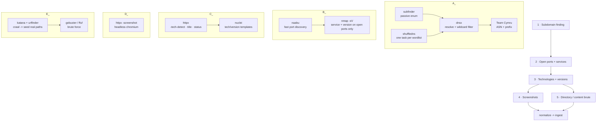

# Worker Scan Pipeline — Stages & Tooling

> The ordered workflow every scan box runs, and the concrete tool behind each stage.
> Companion to `architecture.md` §6. ProjectDiscovery (PD) tools are linked as **Go
> libraries** inside the worker binary (no subprocess, no stdout parsing); the two
> non-PD tools are shelled out to.

## The sequence you specified, as a pipeline

Stages 4 and 5 both consume stage 3's live-HTTP host list and run **in parallel** — a
screenshot and a directory brute don't depend on each other.

---

## Stage-by-stage

### 1 · Subdomain finding

| Tool | Role | Source |
|---|---|---|
| **subfinder** | Passive enumeration from 30+ sources (CT logs, DNS aggregators, and the APIs you have keys for). Zero packets to the target. | PD |
| **shuffledns** | Brute-forces subdomains from a wordlist using **massdns** as the resolver engine. The loud, high-volume option, and the one that finds names no data source lists. | PD (wraps massdns) |
| **dnsx** | Resolves every candidate, follows CNAME chains, and does **wildcard detection** so `*.example.com` doesn't flood you with fake hits. Emits A/AAAA/CNAME/etc. | PD |
| **Team Cymru** | AS number, AS name and announcing prefix for each resolved address, over plain DNS TXT. No binary, no API key, no database file. | — |

**Order:** subfinder and shuffledns run in parallel, then dnsx resolves the union. dnsx is
the gate: only names that actually resolve move downstream, and its resolved IP set feeds
the coalesce barrier in `architecture.md` §4.

**shuffledns runs as its own `dns_brute` stage, one task per wordlist.** The planner fans
out a task per (domain × wordlist), so several lists spread across workers rather than
grinding through one after another on a single box. Each task carries a presigned download
for its wordlist and for the resolver list; the worker caches both by content hash.

Two flag details this codebase learned the hard way, both of which made the stage return
nothing while looking like a clean "found nothing":

- shuffledns here has **no `-mode` flag** — passing `-d` with `-w` is what selects
  brute-force mode. It also runs with `-strict-wildcard`, which re-checks every hit rather
  than sampling, so a wildcarded domain or an NXDOMAIN-hijacking resolver cannot turn the
  whole wordlist into "found" subdomains.
- dnsx spells its retry flag **`-retry`**, not `-retries` like naabu, httpx and nuclei.

**ASN does not come from dnsx.** Its `-asn` flag is accepted but silently returns nothing
in this image, so the worker queries Team Cymru's DNS interface instead. Lookups retry and
the AS-name query is single-flighted, because Cymru rate-limits and a dropped UDP reply
otherwise costs an address its whole ASN.

### 2 · Open ports and services

| Tool | Role | Source |
|---|---|---|
| **naabu** | Fast SYN/CONNECT port discovery. Finds *which ports are open* across the deduped IP set. Needs `CAP_NET_RAW` for SYN; falls back to connect-scan without it (§6.2). | PD |
| **nmap `-sV`** | Runs **only against the open ports naabu already found**, to get true service identity and version banners for **non-web** services (SSH, SMTP, RDP, databases, etc.). This is the piece PD does not provide — naabu tells you a port is open, not what `OpenSSH 8.9p1` is behind it. | non-PD (shelled out) |

**Order:** naabu (wide, fast) → nmap `-sV` (narrow, targeted). Never run nmap across full
port ranges — feed it naabu's hit list. This two-step is the standard fast-discovery /
accurate-fingerprint split and keeps scan traffic proportionate.

> **Decision: nmap is kept.** It is the source of truth for non-web service versions
> (SSH, SMTP, RDP, databases, etc.) — httpx covers web-service versions in stage 3, so
> nmap earns its place specifically on the non-HTTP ports. It runs **only** against the
> ports naabu already reported open, never a full-range scan.

### 3 · Technologies and their versions

| Tool | Role | Source |
|---|---|---|
| **httpx** | Probes every open port for HTTP/HTTPS, then per live endpoint returns: status, title, response headers, **`-tech-detect`** (Wappalyzer engine → product **and version** where exposed), TLS/cert summary, favicon hash, redirect chain, CDN/WAF via **cdncheck**. This single tool produces most of the Shodan-style service detail. | PD |
| **nuclei** | Runs the **technology-detection and version-fingerprint template set** for products httpx can't version from headers alone (specific CMS versions, framework fingerprints). Pin the template revision. | PD |

**Order:** httpx first (it decides which host:port pairs are actually web services), then
nuclei tech templates against only those. nuclei's broader vuln templates belong to the
`vuln_check` stage in `architecture.md`, not here.

### 4 · Screenshots of web services

| Tool | Role | Source |
|---|---|---|
| **httpx `-screenshot`** | Headless-Chromium screenshot of each live web endpoint, from the same tool that already probed it — one HTTP session, consistent target list, no separate wiring. Requires the `browser` capability (bundled Chromium). | PD |

**Order:** consumes stage 3's live-HTTP list. Runs on `browser`-capable workers only;
boxes without Chromium skip it (`architecture.md` §6.2). Screenshots go straight to object
storage via presigned URL — they never transit the gateway.

> Alternative if you want screenshots decoupled from httpx: **gowitness** (Go, standalone).
> httpx `-screenshot` is the tighter integration and the default recommendation.

### 5 · Directory / subdirectory brute forcing

**PD has no directory brute-forcer** — this is the one stage with no ProjectDiscovery answer.
Two tools, used together:

| Tool | Role | Source |
|---|---|---|
| **katana** | Crawls each live site first to discover *real* linked paths, JS endpoints, and forms. Seeds the brute force with ground truth so you're not blindly guessing paths that crawling would have handed you. | PD |
| **gobuster** *(default)* or **ffuf** | The actual content brute force against a wordlist. gobuster is what the worker reaches for first; ffuf is the fallback when gobuster is absent, and a small built-in common-path probe runs when neither is. Hits are re-probed so every reported path carries a real HTTP status. | non-PD |

**Order:** katana and urlfinder (crawl and passive URLs, cheap, seed real paths) → gobuster/ffuf (brute, expensive).
Directory brute is the loudest, most rate-limit-sensitive stage — it fires many requests at
one host, so cap concurrency per target and respect the worker's per-provider rate settings
(`architecture.md` §7.3).

---

## Full tool inventory for the worker image

| # | Stage | ProjectDiscovery | Non-PD |
|---|---|---|---|
| 1 | Subdomains | subfinder, dnsx, shuffledns | massdns *(shuffledns dependency)*, Team Cymru *(ASN, over DNS)* |
| 2 | Ports & services | naabu | **nmap** (`-sV`) |
| 3 | Tech & versions | httpx (`-tech-detect`), nuclei, cdncheck | — |
| 4 | Screenshots | httpx (`-screenshot`) + bundled Chromium | *(gowitness alt.)* |
| 5 | Directory brute | katana, urlfinder (crawl seed) | **gobuster** (default) or **ffuf** |

**Shared PD helpers** already implied above: **dnsx** (resolution throughout), **cdncheck**
(don't port-scan CDN IPs — feeds the `is_shared` flag), **mapcidr** / **asnmap** (expand
CIDR/ASN scope targets before scanning).

### What this means for `architecture.md`

- **Capabilities (§6.2):** stage 4 needs `browser`; stage 2's naabu SYN mode needs
  `raw_socket`. Everything else runs on any box.
- **Non-PD binaries** — nmap, gobuster/ffuf, massdns — are the only shelled-out
  processes and must be baked into the worker image with pinned versions. Everything with a
  PD name is a linked Go library.
- **Stage requirements** map onto `scan_task.requires`: a directory-brute task requires
  nothing special; a screenshot task requires `browser`; a SYN port-scan task requires
  `raw_socket`.

---

## Implementation status (Phase 13)

What the worker actually invokes today, verified by isolated stage gates
(`make tool-test`). Every tool has a pure-Go fallback so a bare worker still runs.

| Stage | Tools wired | Gate |
|---|---|---|
| Subdomains | subfinder (keys via provider-config.yaml), shuffledns (deep) | passed on example.com |
| Resolution | **dnsx** primary, stdlib fallback | passed (wildcard-filtered) |
| Ports | naabu (Tools.md rate/ports) | passed on scanme.nmap.org |
| Service versions | nmap (`-sV`; `-A -p-` deep only) | passed (OpenSSH, Apache versions) |
| Web probe / tech | httpx (`-title -sc -cl -location -fr -tech-detect`) | passed on example.com |
| Screenshots | httpx `-screenshot`, uploaded to object storage | capture verified |
| Crawl | katana | passed (11,983 URLs) |
| Dir brute | gobuster (Tools.md) / ffuf, seeded by katana + urlfinder | passed (cleaned + probed) |
| Vulnerabilities | nuclei (stage was previously unreachable — now wired) | stage reachable |

All tool flags are overridable per run through validated scan parameters
(`internal/scanparams`), never passed to `exec` as raw user input.

Not yet implemented: `gobuster dns` wildcard/vhost bruteforce (13.5); `urlfinder`
stalls without API keys and is hard-capped/optional (13.9).
