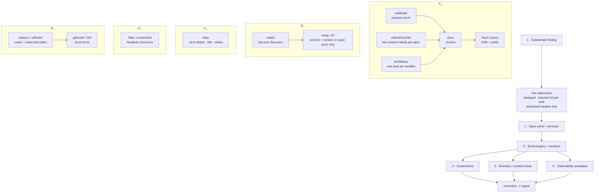

# Worker Scan Pipeline — Stages & Tooling

> The ordered workflow every scan box runs, and the concrete tool behind each stage.
> Companion to `architecture.md` §6. ProjectDiscovery (PD) tools are linked as **Go
> libraries** inside the worker binary (no subprocess, no stdout parsing); the two
> non-PD tools are shelled out to.

## The sequence you specified, as a pipeline



Stages 4 and 5 both consume stage 3's live-HTTP host list and run **in parallel** — a
screenshot and a directory brute don't depend on each other.

**Where the stages run.** Stages 1 and the resolution/enrichment behind it never send a
packet at the target and run on the standing local workers. Everything from stage 2 on
sends traffic at the target and runs from the run's chosen exit — an ephemeral fleet
behind a VPN gateway, or a pool of enrolled remote workers (`architecture.md` §7.6).

**Resolution feeds stage 2 incrementally, not through a barrier.** Addresses are handed
forward as they appear, deduplicated so a shared address behind twenty names is scanned
once, and grouped 64 to a task so the scanners see a real host pool. A slow wordlist no
longer holds back scanning of the hosts already found. Addresses belonging to a
passive-only target are dropped here: they are enumerated and resolved, never probed.

---

## Stage-by-stage

### 1 · Subdomain finding

| Tool | Role | Source |
|---|---|---|
| **subfinder** | Passive enumeration from 30+ sources (CT logs, DNS aggregators, and the APIs you have keys for). Zero packets to the target. | PD |
| **shuffledns** | Brute-forces subdomains from a wordlist using **massdns** as the resolver engine. The loud, high-volume option, and the one that finds names no data source lists. | PD (wraps massdns) |
| **dnsx** | Resolves every candidate, follows CNAME chains, and does **wildcard detection** so `*.example.com` doesn't flood you with fake hits. Emits A/AAAA/CNAME/etc. | PD |
| **Team Cymru** | AS number, AS name and announcing prefix for each resolved address, over plain DNS TXT. No binary, no API key, no database file. | — |

**Order:** subfinder and shuffledns run in parallel, then dnsx resolves the union. dnsx is
the gate: only names that actually resolve move downstream, and its resolved addresses are
coalesced into port-scan batches as they arrive (`architecture.md` §4.1).

**shuffledns runs as its own `dns_brute` stage, one task per wordlist.** The planner fans
out a task per (domain × wordlist), so several lists spread across workers rather than
grinding through one after another on a single box. Each task carries a presigned download
for its wordlist and for the resolver list; the worker caches both by content hash.

Two flag details this codebase learned the hard way, both of which made the stage return
nothing while looking like a clean "found nothing":

- shuffledns here has **no `-mode` flag** — passing `-d` with `-w` is what selects
  brute-force mode. It also runs with `-strict-wildcard`, which re-checks every hit rather
  than sampling, so a wildcarded domain or an NXDOMAIN-hijacking resolver cannot turn the
  whole wordlist into "found" subdomains.
- dnsx spells its retry flag **`-retry`**, not `-retries` like naabu, httpx and nuclei.

**ASN does not come from dnsx.** Its `-asn` flag is accepted but silently returns nothing
in this image, so the worker queries Team Cymru's DNS interface instead. Lookups retry and
the AS-name query is single-flighted, because Cymru rate-limits and a dropped UDP reply
otherwise costs an address its whole ASN.

### 2 · Open ports and services

| Tool | Role | Source |
|---|---|---|
| **naabu** | Fast SYN/CONNECT port discovery. Finds *which ports are open* across the deduped IP set. Needs `CAP_NET_RAW` for SYN; falls back to connect-scan without it (§6.2). | PD |
| **nmap `-sV`** | Runs **only against the open ports naabu already found**, to get true service identity and version banners for **non-web** services (SSH, SMTP, RDP, databases, etc.). This is the piece PD does not provide — naabu tells you a port is open, not what `OpenSSH 8.9p1` is behind it. | non-PD (shelled out) |

**Order depends on how wide the scan is**, because the two-step only pays for itself over a
large range:

| Port selection | What runs |
|---|---|
| `top-100` (the default) | **nmap alone.** At this width it is fast enough and returns versions in the same pass, so a separate discovery sweep adds nothing. |
| `top-1000`, `full`, an explicit range or list, or the `deep` profile | **naabu, then nmap** against only the ports naabu reported open. |

Never run nmap across a full port range — feed it naabu's hit list. Both scanners take the
task's whole address pool at once (`-iL -`), which is what makes `--min-hostgroup` and the
rate limits mean anything; given one address at a time they are decorative.

The exact flags, every tunable and what the defaults cost in noise are in the
[Port scanning](wiki/Port-Scanning.md) wiki page.

> **Decision: nmap is kept.** It is the source of truth for non-web service versions
> (SSH, SMTP, RDP, databases, etc.) — httpx covers web-service versions in stage 3, so
> nmap earns its place specifically on the non-HTTP ports. It runs **only** against the
> ports naabu already reported open, never a full-range scan.

### 3 · Technologies and their versions

| Tool | Role | Source |
|---|---|---|
| **httpx** | Probes every open port for HTTP/HTTPS, then per live endpoint returns: status, title, response headers, **`-tech-detect`** (Wappalyzer engine → product **and version** where exposed), TLS/cert summary, favicon hash, redirect chain, CDN/WAF via **cdncheck**. This single tool produces most of the Shodan-style service detail. | PD |

**Cookie names are recorded alongside the headers**, and only the names. A product often
sets a cookie whose name is unique to it — `webvpn`, `webvpnlogin` and `webvpnLang` for
Cisco ASA WebVPN, `BIGipServer<pool>` for an F5, `NSC_*` for Citrix — so the name
identifies the appliance where the banner and title give nothing away. They are searchable
across the whole inventory with `cookie:webvpn*`. A cookie's **value** is a session token
and is never stored — `Set-Cookie` is dropped from the recorded headers, not kept verbatim.

`tools/cookielab` is a one-page target that sets these cookies, so the capture and the
search can be exercised without pointing the scanner at somebody else's appliance:

```bash
docker compose --profile lab up -d cookielab
ASM_ALLOW_PRIVATE_TARGETS=true docker compose up -d api scheduler
# add its container IP as an authorized ip target, scan, then: cookie:webvpn*
```
| **nuclei** | Runs only in the `vuln_check` stage, against each live web endpoint the probe found: default templates at severity *low* and above (per-run `nuclei_severity`), `ASM_NUCLEI_TEMPLATES` for a pinned or custom set. Tech detection is httpx alone; nuclei's tech templates were planned here and never wired. | PD |

**Order:** httpx first (it decides which host:port pairs are actually web services), then
nuclei tech templates against only those. nuclei's broader vuln templates belong to the
`vuln_check` stage in `architecture.md`, not here.

### 4 · Screenshots of web services

| Tool | Role | Source |
|---|---|---|
| **httpx `-screenshot`** | Headless-Chromium screenshot of each live web endpoint, from the same tool that already probed it — one HTTP session, consistent target list, no separate wiring. Requires the `browser` capability (bundled Chromium). | PD |

**Order:** consumes stage 3's live-HTTP list. Runs on `browser`-capable workers only;
boxes without Chromium skip it (`architecture.md` §6.2). Screenshots go straight to object
storage via presigned URL — they never transit the gateway on the way in.

They do on the way out: the UI reads one through `GET /api/v1/services/{id}/screenshot`,
which streams it from storage. A presigned URL in the page would be blocked by the app's
`img-src 'self'` policy, and would hand a bearer token for that object to anything able to
read the page. Screenshots are addressed by service, so the object key never leaves the
server. A service with one offers a button on the host page and in the Hosts list.

> Alternative if you want screenshots decoupled from httpx: **gowitness** (Go, standalone).
> httpx `-screenshot` is the tighter integration and the default recommendation.

### 5 · Directory / subdirectory brute forcing

**PD has no directory brute-forcer** — this is the one stage with no ProjectDiscovery answer.
Two tools, used together:

| Tool | Role | Source |
|---|---|---|
| **katana** | Crawls each live site first to discover *real* linked paths, JS endpoints, and forms. Seeds the brute force with ground truth so you're not blindly guessing paths that crawling would have handed you. | PD |
| **gobuster** *(default)* or **ffuf** | The actual content brute force against a wordlist. gobuster is what the worker reaches for first; ffuf is the fallback when gobuster is absent, and a small built-in common-path probe runs when neither is. Hits are re-probed so every reported path carries a real HTTP status. | non-PD |

**The wordlist comes from the registry**, like the subdomain and resolver lists: whichever
`dir` list is marked default is delivered to the job as a presigned URL and cached on the
worker by content hash. A run without one falls back to the list baked into the worker
image. Because directory search uses a single list rather than fanning out one task per
list, marking several default picks the first by name — dispatch logs which one it used.

**Order:** katana and urlfinder (crawl and passive URLs, cheap, seed real paths) → gobuster/ffuf (brute, expensive).
Directory brute is the loudest, most rate-limit-sensitive stage — it fires many requests at
one host, so cap concurrency per target and respect the worker's per-provider rate settings
(`architecture.md` §7.3).

---

## Full tool inventory for the worker image

| # | Stage | ProjectDiscovery | Non-PD |
|---|---|---|---|
| 1 | Subdomains | subfinder, dnsx, shuffledns | massdns *(shuffledns dependency)*, Team Cymru *(ASN, over DNS)* |
| 2 | Ports & services | naabu | **nmap** (`-sV`) |
| 3 | Tech & versions | httpx (`-tech-detect`) | — |
| 4 | Screenshots | httpx (`-screenshot`) + bundled Chromium | *(gowitness alt.)* |
| 5 | Directory brute | katana, urlfinder (crawl seed) | **gobuster** (default) or **ffuf** |

**Shared PD helpers** already implied above: **dnsx** (resolution throughout), **cdncheck**
(don't port-scan CDN IPs — feeds the `is_shared` flag), **mapcidr** / **asnmap** (expand
CIDR/ASN scope targets before scanning).

### What this means for `architecture.md`

- **Capabilities (§6.2):** stage 4 needs `browser`; stage 2's naabu SYN mode needs
  `raw_socket`. Everything else runs on any box.
- **Non-PD binaries** — nmap, gobuster/ffuf, massdns — are the only shelled-out
  processes and must be baked into the worker image with pinned versions. Everything with a
  PD name is a linked Go library.
- **Stage requirements** map onto `scan_task.requires`: a directory-brute task requires
  nothing special; a screenshot task requires `browser`; a SYN port-scan task requires
  `raw_socket`.

---

## Implementation status

What the worker invokes today, and what each stage has been observed to record. A tool
running is not the same as its results being stored, and this pipeline has lost a stage's
entire output to that gap more than once — so the column that matters is the last one.

| Stage | Tools wired | Verified end to end |
|---|---|---|
| Subdomains | subfinder (keys via provider-config.yaml), shuffledns | names recorded, per-wordlist tasks |
| Resolution | **dnsx** primary, stdlib fallback; a wildcard probe per apex | addresses + PTR; a wildcard apex is flagged and names resolving only to its address are dropped |
| Enrichment | Team Cymru DNS TXT | ASN, AS name, announcing prefix |
| Ports | nmap alone at `top-100`; naabu → nmap when wider | 22/tcp and 80/tcp on scanme.nmap.org |
| Service versions | nmap `-sV` (`-A -vvv` on deep) | `OpenSSH 6.6.1p1`, `Apache 2.4.7` |
| Web probe / tech | httpx (`-title -sc -cl -location -fr -tech-detect`) | `Apache HTTP Server 2.4.7`, `Ubuntu` |
| Screenshots | httpx `-screenshot` → object storage | PNG stored and viewable in the UI |
| Crawl | katana, urlfinder | seeds real paths before the brute |
| Dir brute | gobuster (registry wordlist) / ffuf | gobuster hits recorded as findings |
| Vulnerabilities | nuclei | findings recorded (the stage was never planned until 18.1) |

All tool flags are overridable per run through validated scan parameters
(`internal/scanparams`), never passed to `exec` as raw user input.

Every invocation is logged with its result count and duration, a tool that exits cleanly
while producing nothing and writing to stderr is reported as a failure, and a batch of
results the gateway refuses is reported by both ends rather than silently dropped. Those
three checks are what make "the stage ran" and "the stage recorded something"
distinguishable.

Wildcard handling (13.5) is done by probing rather than by `gobuster dns`: two random
labels per apex, the union of their addresses is the wildcard set. Still optional:
`urlfinder` stalls without API keys and is hard-capped (13.9).

Passive names are stored whether or not they resolve — for a famous domain most do not
— so the dashboard leads with the names that resolve and gives the rest as a sub-line.
